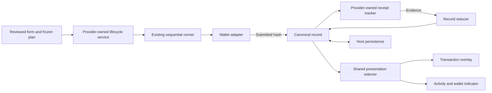

# Transaction lifecycle implementation progress

Branch: `codex/transaction-lifecycle-v2`, rebased onto `origin/main` at `8774a145` on 2026-09-18.
Last committed integration: `50a8f398` (dedicated bridge coordination Redis configuration).
Design: [v2 proposal](./v2-transaction-lifecycle.md).

## Current status (2026-09-25)

| Work | Status |
| --- | --- |
| Stages 1–3 | Implemented; controlled real-wallet/Safe parity still needs verification. |
| Stage 4 | Enabled by default in Yearn; local shared Redis validation passes; controlled bridge QA remains pending. |
| Stage 5 | Started: shared version-0 legacy decoder. Canonical history cutover and acknowledgement remain pending. |
| Simplification | First deletion pass complete; old owners remain until migration/rollout gates pass. |

Historical validation counts below describe their individual stages, not the latest checkout.

Each completed stage must preserve existing supported transaction flows and equivalent normal UX.
Unmigrated paths keep their existing implementation. Document intentional failure/status changes and
verify the affected flows with controlled wallet QA before rollout. Stages 1 and 2 have automated regression coverage,
but end-to-end transaction and UX parity has not yet been established with actual wallets.

## Stage 1: bounded reliability fixes

Implemented:

- Shared source confirmation policy: two confirmations on Base, one elsewhere. The legacy overlay,
  Yearn execution adapter configuration, and EOA/Safe background reconciliation use this policy.
  RPC reads use the execution chain; confirmation depth uses the canonical chain.
- EOA, Safe-service, and wallet-reported execution hashes converge on one receipt settlement path.
  Safe internal failure remains failure even when its outer transaction succeeds. Stale hash results
  and results arriving after unmount are discarded.
- Source confirmation and bridge delivery are saved before background balance refresh starts.
  Background refresh cannot block other tracking. Overlay and planned refresh waits have a ten-second
  deadline. A refresh failure displays “Transaction confirmed” with Close, preserving the successful
  notification and offering no transaction resubmission.
- Delivered bridge links select a complete destination hash/chain pair, falling back to the complete
  source reference when destination information is incomplete.
- Bridge selection checks the least recently checked record, with stable ID ordering for ties.
- The wallet indicator derives from the current wallet's cached records, including after reload.
  Active/unresolved records take priority over terminal outcomes. Metadata-only updates cannot clear it.
  During this migration, terminal failure/success indicators expire after five minutes; persistent
  acknowledgement is deferred to the canonical record model.

Regression coverage includes confirmation depth across all three source paths, Safe internal failure,
refresh rejection/timeouts, bridge scheduling after a stalled refresh, stale observations, incomplete
explorer references, concurrent notifications, account switching, hydration, deletion, and indicator expiry.

## Stage 2: one complete same-chain path

Implemented for single-call, same-chain EOA deposits and withdrawals: direct routes, direct staking/unstaking,
supported yBOLD zapper calls, and raw Enso routes when approval is already satisfied. Approval/permit sequences,
dynamic unstake sequences, Safe proposals/batches, and cross-chain routes retain the existing implementation.
Eligibility is selected when the transaction overlay opens and the submitted plan is frozen.

The path now has these owners:

- The framework-free lifecycle service reuses `executeTransactionPlan`; it does not introduce a second
  executor. The former overlay-owned planned controller is removed. The new overlay subscribes to records
  and never polls receipts or writes notification status.
- A stable command and intent identity prevent duplicate starts within a service. Wallet account and execution
  network are checked before preparation and immediately before submission. Closing during preparation stops
  the send; a hash returned after closing is still registered and tracked.
- Raw Enso submissions validate the reviewed calldata with the existing simulation before sending it through
  the same wallet adapter as direct calls. Changed or invalid quotes require another review.
- Submitted records retain owner, exact request, display snapshot, original/effective hash and chain pairs,
  confirmation policy, receipt/replacement evidence, and separate refresh/tracking/storage health. The reducer
  rejects unrelated receipts, ignores duplicate observations, and retains conflicts as unresolved evidence.
- Yearn owns one service above its notification and route providers. Its separate IndexedDB store performs
  atomic read/reduce/write operations; BroadcastChannel shares updates and Web Locks coordinate receipt
  observation across tabs. The widget runtime supplies an in-memory service for other hosts, including yBOLD.
- Each initial history read is bounded; recovery stays unresolved until a read succeeds and precedes wallet submission. An unfinished saved intent is adopted instead
  of resubmitted. Reload resumes observation of submitted records; it never resumes wallet actions. Storage
  failures retain the submitted hash in memory, show a recovery warning, and retry under the same record ID.
- Activity and the wallet indicator receive read-only projections of the canonical records. Both legacy pollers
  explicitly exclude these projections. Existing notification rows keep their existing tracker.
- Source success is visible before balance refresh completes. Refresh has a ten-second deadline and an explicit
  refresh-only retry. RPC outages retain the original reference and retry observation without requesting another
  wallet action. A stale refresh failure cannot replace another worker's completed refresh.

Intentional status/interaction changes: pending transactions may be closed while tracking continues; uncertain
confirmation offers rechecking, never resubmission; refresh failure preserves transaction success and offers
“Refresh balances”; wallet rejection displays cancellation with Close. Normal success labels and completion
callbacks are retained. These differences still require controlled wallet QA before rollout.

### Stage 2 validation

- 323 widget tests passed across 41 files, including direct/raw Enso overlay integration, StrictMode/remount,
  duplicate starts, late hashes, account/network changes, replacement outcomes, storage rejection/stalls,
  delayed hydration, conflicting evidence, and refresh-only retry.
- 42 focused Yearn tests passed across nine files; all five yBOLD tests passed across three files.
- Yearn, yBOLD, and widget TypeScript checks passed. Biome and both client/server and widget package
  boundary checks passed. Yearn and yBOLD production builds passed.
- Chromium used the actual service, overlay, IndexedDB store, BroadcastChannel, and Web Locks with a simulated
  wallet. Two tabs used one observer; reload issued no wallet request; closing the overlay preserved tracking.
  Concurrent writes preserved receipt evidence, native receipt BigInts, and the exact decimal amount
  `1000000000000000001`. Desktop/mobile checks reported no overflow or browser errors.
- Real-wallet signing, mined on-chain transactions, Safe, and bridge QA have not been performed. The sandbox
  demonstrates lifecycle behavior and is not proof of production transaction or visual parity.

### Remaining stages and limits

Stages 3 and 4 are implemented below. Stage 4 is now enabled by default in Yearn; stage 5 completes legacy
persistence/presentation cutover and versioned decoding. The shared Enso gateway is implemented.

The durable guarantee starts once the submitted record is saved. A page closed before the wallet returns a hash,
or while storage remains unavailable, cannot promise reload recovery. No-hash ambiguous wallet responses remain
session-local and require wallet inspection. Stronger replacement discovery after reload is not implemented.
yBOLD history remains session-only. Browsers without Web Locks retain per-provider observation and atomic evidence
writes, but cannot guarantee a single observer across tabs. Refresh is safe to repeat across hosts; it is not an
exactly-once distributed effect. Legacy history migration, acknowledgements, and canonical record deletion are
not part of stage 2.

## Stage 1 validation

- 221 focused tests passed across 20 test files (161 widget, 60 Yearn).
- Yearn, yBOLD, and widget TypeScript checks passed.
- Biome formatting and the widget package boundary check passed.
- Production build passed with a fresh Turbopack cache after a sandbox worker-port failure.
- The private HTML implementation review passed Chromium desktop/mobile checks.

## Stage 2 review corrections

The review of `8ccbc4c9` identified two implementation defects: failed initial history reads could allow
resubmission, and existing tabs could omit a persisted receipt conflict.

- Durable hosts now expose loading/ready/unavailable history state. Rejected or stalled reads keep wallet
  submission waiting, retry automatically, and offer a history retry in the overlay. A successful read adopts
  a matching pending record before execution. Account/network/close checks still run after recovery.
- Persisted conflicts merge monotonically through the reducer, including atomic write retries. Higher-revision
  clean snapshots cannot erase a known conflict. Existing and freshly opened tabs derive the same unresolved
  outcome. Original receipt identity checks and stale-evidence protections remain in place.
- Regression coverage includes failed/stalled reads followed by recovery, repeated failures, disconnected
  reads, account/network/close changes during recovery, conflict propagation, stale clean snapshots, and the
  overlay's history retry. In-memory execution and tracking after failed writes retain their existing tests.

### Replacement confirmation retries

A subsequent audit found that a detected replacement was lost when its confirmation-depth wait failed.
The Wagmi adapter now retains validated provisional replacement evidence under the original submission's
execution-chain/hash key. Retries query the replacement hash and fetch a fresh receipt at the required
confirmation depth. Cancellation and unrelated replacement keep their distinct outcomes; malformed
replacement evidence is rejected before it can enter the cache. The context is removed after settlement.
This is session-local recovery, including transactions observed after reload; it does not add durable
provisional evidence or historical replacement discovery across a further reload.

Regression coverage uses the actual Viem waiter with a deterministic RPC transport: detect the replacement,
fail the second-confirmation read, advance beyond the replacement block, and recover without another wallet
request. The matrix covers repriced/cancelled/replaced transactions and RPC rejection/timeouts, alongside
public-only observations, fresh reverted receipts, and mismatched receipt rejection.

Validation: all 339 widget tests, workspace TypeScript, lint, the widget package boundary check, and the
Yearn production build passed. These checks use simulated RPC evidence; real-wallet replacement QA remains
unverified.

## Stage 3A: direct approval sequences

Commit `fc3a0b4e` migrates same-chain EOA approval → direct deposit and approval → direct stake sequences.
The remainder of stage 3 is described below.

- The existing headless runner exposes a step boundary with the confirmed outcome. The lifecycle service can
  now run ordered EOA approval/reset/action steps, with one canonical record per accepted submission and a
  separate step index/count/label. Initial history recovery still gates every new flow.
- Direct deposit/stake plans reuse the existing call builders and freeze approval amount, spender, recipient,
  and action calldata when reviewed. The wallet adapter estimates each call immediately before its own send;
  deposit/stake preparation therefore happens after approval confirmation against current chain state.
  Allowance-reset warnings keep their existing eligibility rules.
- Approval success advances the runner, not a React completion effect. Intermediate confirmation never invokes
  final completion or the final balance refresh. Each submitted record keeps its own notification snapshot.
  Failed/cancelled/replaced or unresolved approvals stop the sequence. Refresh failure is independent of
  advancing from a confirmed approval.
- Closing tracks the accepted approval but pauses the next wallet request. Reopening only reattaches;
  explicit Continue rechecks the reviewed wallet/network. Account/network changes between steps also pause.
  A change during simulation blocks submission, and later conflicting approval evidence blocks continuation.
- Host coordination holds a flow key through the reviewed sequence, including pauses, in addition to record
  keys during observation. A second tab cannot request the same intent between approval confirmation and the
  deposit hash when Web Locks are available. Initial history is re-read inside that flow lock. Another tab
  asks the user to continue in the active window; observation and activity updates remain shared.
- Reload restores submitted records and chooses the highest submitted step regardless of storage row order.
  It does not reconstruct an executable recipe or resume signatures. A recovered intermediate success asks
  the user to close and review the remaining action; current allowance determines the newly reviewed plan.
- The overlay shows step progress and derives final success from the final record. The legacy overlay remains
  the fallback for every unmigrated path. No dependencies were added.

Validation: 369 widget tests pass, including sequential ordering, late approval hashes, duplicate starts at
step boundaries, pause/Continue, changed wallets during simulation, refresh independence, failed approvals,
receipt conflicts, reload recovery, and cross-service intent ownership. Chromium checks using actual IndexedDB,
BroadcastChannel, and Web Locks pass for two-step execution, closing/reopening, a competing tab, latest-step
reload recovery, and desktop/mobile rendering. Wallet requests and receipts in these checks are simulated;
controlled real-wallet execution remains required before rollout.

Workspace TypeScript, lint, both boundary checks, and Yearn/yBOLD production builds pass. The Yearn
production preview also passes deposit/withdraw tab navigation and desktop/mobile overflow/error checks.

## Stage 3: remaining sequential and Safe paths

Implemented on top of `fc3a0b4e`. All supported same-chain overlays now use the provider-owned runner and
tracker, including Enso approvals, permit migrations, dynamic unstake/withdraw, Safe proposals/batches,
approval management, rewards, portfolio claims, and yvUSD cooldown/unlock/withdraw actions. Cross-chain
flows keep their existing implementation until stage 4.

- Deferred steps let existing route hooks supply the next preparation after the preceding receipt or signature.
  A small preparation bridge attaches the current reviewed form to the headless runner; it does not request the
  wallet, poll receipts, write history, or decide transaction success. Route callbacks update preparation inputs.
  The shared runner owns ordering and advancement. Submission rechecks the reviewed owner, wallet type,
  network, form identity, protected quote or Safe calls, and all prerequisite receipts.
- Permit signatures stay in session memory and do not create transaction records. Migration reads a fresh nonce
  and twenty-minute deadline for each signing attempt. The adapter checks owner, contract, spender, amount,
  network, expiry, and the current on-chain nonce before requesting a signature. An unavailable nonce blocks
  signing. Safe migrations use approval transactions instead of EOA permits. A paused signature flow requires
  Continue; expired or invalid authorizations require another review rather than replaying a prerequisite.
- Safe proposals retain an opaque proposal ID and all atomic calls in one canonical record. No transaction link
  or success is inferred from that ID. The adapter observes Safe's calls-status execution result; the tracker then
  requires the actual source receipt at the saved confirmation depth. Internal failure/cancellation is terminal
  even if the outer transaction succeeded. Observation outages retry without reproposing. Persisted Safe conflicts
  are monotonic and propagate to existing and freshly opened tabs.
- Dynamic unstake continuations derive received shares from transfers by the reviewed staking contract to the
  reviewed owner in that receipt. Unrelated wallet transfers are excluded. MAX uses the attributable shares;
  fixed-share continuation requires sufficient received shares. The reviewed amount survives closing and the
  form's automatic switch to vault shares. Manual source/amount changes require a distinct review.
- The yvUSD unlock-and-withdraw path redeems the exact unlocked shares attributed to its receipt. This intentionally
  replaces its earlier final `withdraw` call based on a pre-unlock asset preview, avoiding consumption of unrelated
  unlocked shares or failure when the preview drifts. Displayed output remains an estimate until execution.
- Approval management no longer owns wallet writes, receipt waits, or Safe polling. Its submissions use canonical
  history and the shared overlay. Unused approval tracking helpers and disconnected reward-row writer hooks are
  removed. Reward claims and yvUSD actions provide their own history descriptors.
- Closing keeps accepted submissions tracking and pauses later wallet requests. Remounting does not automatically
  continue. Reload restores submitted records, including Safe proposals, but does not reconstruct an executable
  recipe or persisted permit. The user reviews the remaining action against current state. Malformed/unsupported
  durable records leave history recovery unavailable rather than silently being treated as empty history.

Validation includes 385 widget tests and 39 focused Yearn tests; workspace TypeScript, lint, both boundary checks,
and Yearn/yBOLD production builds. New regression coverage checks permit nonce/expiry rejection, receipt-derived
shares, deferred preparation through React StrictMode and remounts, approval management, Safe execution failure,
late proposals, hydration, and absence of duplicate wallet requests. Chromium uses actual IndexedDB,
BroadcastChannel, and Web Locks to check Safe reload recovery, receipt gating, conflict propagation, sequence
continuation, and desktop/mobile rendering. Wallet and receipt inputs in these browser checks are simulated.

Controlled real-wallet/Safe transaction QA remains required before rollout. yBOLD remains session-only; a host
without Web Locks cannot guarantee single observation across tabs. Safe observation needs an available wallet
calls-status provider and stays unresolved if that provider is unavailable. Technical approval-row grouping,
legacy history decoding, and acknowledgement policy remain part of stage 5.

## Stage 3 correction: stable identity when reopening Enso

Deposit and withdrawal now use the same reviewed intent ID for their deferred recipe and ready execution plan.
Approval completion can change which path is eligible without creating a new intent. Reopening adopts the
accepted flow, including a final wallet request whose hash has not returned yet. Ready plans retain their explicit
recipe attachment so a paused deferred runner receives the current preparation when the user chooses Continue.
Preparation bridges belong to an accepted flow; a completed flow cannot lend stale steps to a new transaction.

Previous plan IDs remain read/lock aliases for existing records and older tabs; new records use the canonical ID.
An opening tab can adopt saved pending history while another tab holds the execution lock. Failed history recovery
still prevents submission. Wallet, network, protected-quote checks and explicit Continue remain required.

Validation: all 1,253 repository tests pass (408 widget, 840 Yearn, 5 yBOLD), including 23 new regressions for path
changes, late hashes, persisted recovery, old IDs/locks, paused continuation, guards, and fresh recipe ownership.
Workspace TypeScript, lint, both boundary checks, and Yearn/yBOLD production builds pass. Eight Chromium scenarios
cover both Enso modes through the actual shared overlay, plan builder, service, native IndexedDB, BroadcastChannel,
and Web Locks. These harnesses mirror the widget's path selection; wallet calls and receipts are simulated.

## Stage 4: destination settlement (enabled by default in Yearn)

The shared lifecycle now accepts a source-chain sequence with a fixed Enso destination requirement. Approval
records remain same-chain; the final source submission captures the executable quote's available protocols,
stable leg IDs, coverage and delivery estimate. Missing metadata and unknown protocol names do not weaken the
destination requirement. The deposit recipe uses the source network, including when the vault is on another chain.

The reducer admits destination evidence only after the source receipt succeeds. Overall delivery can complete
without a destination hash; partial evidence requires all known legs and callbacks. Conflicting terminal evidence
stays unresolved. Observations retain references and previously admitted leg, callback and refund evidence.
A refund remains a failed requested action. Explorer links use complete hash/network pairs. Supported external
trackers and explicit bridge rechecks are available in the overlay and recent transaction activity.

The provider owns a fair settlement queue, selecting never-checked and then least-recently checked records under
one host lock. Successful checks, outages and gateway deferrals all advance attempt time. Reload restores the
record and tracking; no wallet request is reconstructed. Source, destination and observed-refund balance refreshes
are separate bounded effects. A 24-hour observation budget pauses unresolved work visibly; Recheck bridge renews
observation without submitting. Failed actions with unresolved supported recovery remain eligible for observation.

The Enso adapter validates source/destination references, preserves cached observation times, rotates protocol
checks for multi-protocol routes, and normalizes manual action and refund evidence. It does not invent recovery
transactions or trust arbitrary provider URLs. Routes whose status endpoint cannot establish sufficient leg or
callback coverage remain unresolved with a source/tracker link. No in-app CCTP claim adapter is introduced.

The server gateway uses the existing Upstash Redis dependency for an atomic credential-scoped queue, request cache,
and pacing across instances. Any request can service the oldest queued route, including one whose original tab
closed. Redis time owns a conservative 30-second reservation covering the bounded upstream operation and provider
cooldown; HTTP 429 extends backoff. Cached responses retain their original observation time and next eligible time.
The queue is bounded to 1,024 entries and expires abandoned entries. Coordination failure returns an observation
limitation and makes no upstream request. All consumers of the shared Enso status credential must use this gateway
and the same Redis database for the budget guarantee to hold.

Tracking requires `UPSTASH_REDIS_REST_URL_BRIDGE_COORDINATION` and
`UPSTASH_REDIS_REST_TOKEN_BRIDGE_COORDINATION` on every server instance. Local DOA and bridge coordination credentials are now configured separately.
Yearn always supplies the settlement observer and routes bridge status through the shared gateway.
Unavailable Redis returns a retryable tracking limitation; it does not select the legacy implementation.
Unfinished legacy cross-chain notifications for the reviewed wallet block a new
cross-chain submission until the earlier outcome is reconciled; unreadable legacy history also blocks submission.
Stage 5 will replace that conservative migration guard with legacy record decoding and presentation cutover.

Validation covers reducer evidence/coverage rules, source-receipt gating, refresh isolation, fair retry selection,
reload adoption, observation-budget renewal, unknown protocol metadata, gateway deferrals/cache/backoff, and the
legacy migration guard. Chromium uses native IndexedDB, BroadcastChannel and Web Locks for both deposit and
withdrawal: close/reopen, competing tabs, reload, manual action, refund, outage recovery and legacy pending-history
blocking. Real Redis checks exercise concurrent claims, queue advancement, cached evidence and servicing an absent
tab's queued route. Wallet calls, source receipts and provider outcomes in these checks are simulated; controlled
real-wallet/bridge QA and shared Redis deployment configuration are required before production release.

Final checks pass: 1,289 tests across the three workspaces (428 widget, 856 Yearn, 5 yBOLD), workspace TypeScript,
lint, both architecture boundary checks, and Yearn/yBOLD production builds. The rebuilt Yearn preview passes
deposit/withdraw navigation and desktop/mobile overflow and browser-error checks. Eight native browser scenarios
cover the new settlement path and legacy migration guard; the interactive sandbox also fits the mobile viewport.

### Stage 4 review corrections

The review of `f41f25d4` identified incorrect attribution when a caller serviced another queued route,
and dropped provider backoff between the status proxy and gateway.

- Queue payloads now contain the complete validated protocol, source chain, transaction hash and optional
  Relay request ID. The worker validates and executes the selected payload independently of the current
  HTTP caller. Relay fallback and the shared credential budget remain intact.
- Provider `Retry-After` survives proxying, including non-JSON errors. Redis atomically extends backoff
  without shortening an existing reservation; numeric delays and HTTP dates produce the shared retry
  deadline returned to clients. Cached errors retain the evidence timestamp and remaining retry delay.
- Validation passes 42 focused tests, including API/gateway integration, and five checks against isolated
  Redis covering queued attribution, competing requests and concurrent backoff. TypeScript, lint, both
  boundary checks and the Yearn production build pass. The bridge rollout flag was disabled at that review; it was removed on 2026-09-25.

## Next: stage 5

Decode legacy persistence without inventing missing evidence, complete activity/acknowledgement presentation,
and remove superseded execution/notification ownership after the rollout gates are satisfied.

## Simplification pass 1

Removed the retired planned-controller error module and receipt forwarding module. The legacy overlay now
represents only the refresh/submission error distinction it uses. Shared source-confirmation checks, one frozen
reviewed plan, common ready-plan construction and explicit overlay copy branches remove duplication without
changing rollout eligibility. Existing receipt, sequence, quote and recovery regression coverage is retained.

The next deletion targets have concrete prerequisites:

| Old owner | Replacement | Required before removal |
| --- | --- | --- |
| Legacy transaction overlay | Lifecycle overlay and service | Migrate every remaining caller/host fallback; validate bridge rollout and transaction UX. |
| Legacy notification pollers and partial status writers | Service observers and record reducer | Decode existing history and move remaining consumers to canonical records. |
| Notification projection and conservative legacy bridge guard | Canonical activity and legacy record decoding | Complete persistence/presentation cutover while preserving old unresolved transfers. |
| React preparation bridge | Reviewed executable recipes | Replace hook-driven continuation with reviewed executable recipes; preserve quote validation and explicit Continue. |

The service's flow/record state and its separate storage/live merge paths need a deeper design pass. Their
policies currently differ; this conservative pass does not merge them or claim those responsibilities are removed.

## 2026-09-18: rebase and stage 5 foundation

- Rebased all ten lifecycle commits onto `8774a145`; preserved main's withdrawal amount validation.
- Gateway, regression tests, and activation documentation use only the dedicated
  `UPSTASH_REDIS_REST_*_BRIDGE_COORDINATION` pair, with no DOA fallback.
- Rebase verification: 434 widget tests, 19 gateway tests, workspace TypeScript, both boundary checks,
  and a webpack production build passed. Turbopack encountered an environment worker-port restriction.
- Stage 5 begins with one runtime decoder for unversioned/version-0 legacy notification history.
  Activity hydration and the legacy bridge guard reject malformed/unsupported batches rather than
  silently discarding entries. Decoding preserves original rows and reported status; it never fabricates
  receipt evidence, transaction hashes, timestamps, executable requests, or canonical flow membership.
  This is a compatibility boundary, not a completed canonical migration. Existing legacy trackers remain owners.

Remaining work, in order:

1. Validate production deployment configuration and scheduling across deployed instances. The local configured
   Upstash instance passes isolated competing-client gateway checks (see below), but this does not certify
   every deployment uses the same database. Complete controlled bridge QA before merging/releasing.
2. Exercise direct/approval/Enso/Safe/bridge execution with controlled wallets or a clearly labelled virtual
   network. Actual-wallet parity remains unverified; simulated tests must not be reported as real execution.
3. Define limited historical records separately from executable canonical records, then migrate their
   activity presentation and tracking ownership without inventing missing evidence. Preserve old rows for rollback.
4. Add persisted acknowledgement and technical approval grouping, using shared owner-scoped selectors.
5. Remove legacy partial-update APIs, pollers, projections, and overlay fallbacks only when every remaining
   producer/host is migrated and rollout/rollback checks pass. The first simplification pass is not this cutover.

The untracked root `.env.example` is user-owned and is not part of this implementation pass.

### Live bridge coordination validation

The local bridge URL had an unmatched trailing quote; it was corrected without changing credentials.
An isolated namespace on the configured Upstash instance verified atomic Lua execution/Redis time,
competing clients sharing one cooldown, cache reuse, and servicing another caller's queued JSON route.
All validation keys were removed. No Enso requests or wallet transactions were made. The configured
bridge URL differs from the DOA URL; production deployment settings have not been inspected.

This exposed an SDK integration defect: Upstash recursively deserializes JSON Lua return values by default.
The gateway requires raw JSON strings for queued request identities and cached response decoding. Its client
now disables automatic deserialization. Regression tests retain the actual Upstash SDK and simulate its HTTP
wire response, including base64 encoding, rather than replacing the Redis client with a mock.

Current pass validation: all 890 Yearn tests, workspace TypeScript, formatting/lint for changed source files,
and both architecture boundary checks pass. This includes real-SDK queue/cache serialization regressions,
legacy malformed/future-version rejection, preservation of partial historical evidence, and hydration errors
without database mutation. The webpack production build passes. Chromium checks on the rebuilt preview
pass desktop/mobile rendering, deposit/withdraw tab navigation, no horizontal overflow, and no page errors.
These checks do not exercise connected-wallet signing.

## 2026-09-25: remove the bridge rollout flag

Yearn now enables destination settlement unconditionally. The bridge status API always uses the Redis
coordination gateway, and the environment template no longer advertises an opt-in flag. Existing local
values of the retired flag have no effect. Same-chain behavior, legacy-history guards, and host capability
fallbacks remain unchanged. No old records are deleted or rewritten by this change.

The lifecycle branch and its private preview are the test boundary. Controlled wallet/Safe/bridge parity
remains a release requirement, not a reason to hide the new path in the development branch.

Validation: 48 focused gateway/proxy/settlement/history-guard tests, Yearn TypeScript, changed-source
formatting/lint, both architecture boundary checks, and the webpack production build pass. The rebuilt
preview passes Chromium desktop/mobile rendering and deposit/withdraw navigation without page errors or
horizontal overflow. Connected-wallet cross-chain execution has not yet been tested in this build.

## 2026-09-25: restore initial wallet network switching

Manual QA found that opening an approval/cross-chain withdrawal on another wallet network displayed
“Wallet or network changed” instead of requesting the source-chain switch. The lifecycle service now
requests the canonical source chain through the existing adapter after history recovery and duplicate
adoption checks, before preparing the first action. It waits up to ten seconds after wallet approval for
host network state to update, then retains the existing account, network, quote, and pre-submission checks.
Closing or changing the account during switching prevents submission; rejected/unsuccessful switches do
not create records. Mid-sequence network changes still pause for explicit Continue.

Regression coverage includes delayed host updates, duplicate starts, rejection, close/account changes,
wrong-chain results, timeout, already-correct networks, and approval → bridge execution switching to the
source rather than destination. All 441 widget tests passed, followed by the expanded 54-test service suite
including the approval/bridge regression. Real-wallet confirmation of the fix remains pending.

Workspace TypeScript, both boundary checks, the webpack production build, and refreshed Chromium
desktop/mobile navigation smoke checks also pass. The preview now includes the network-switch fix.
