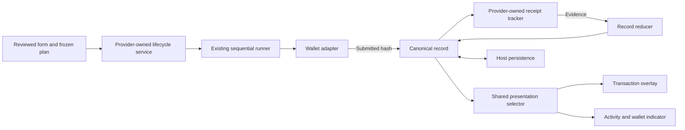

# Transaction lifecycle implementation progress

Branch: `codex/transaction-lifecycle-v2`, based on `main` at `afd41bcb`.
Design: [v2 proposal](./v2-transaction-lifecycle.md).

Each completed stage must preserve existing supported transaction flows and equivalent normal UX.
Unmigrated paths keep their existing implementation. Document intentional failure/status changes and
verify the affected flows with controlled wallet QA before rollout. Stages 1 and 2 have automated regression coverage,
but end-to-end transaction and UX parity has not yet been established with actual wallets.

## Stage 1: bounded reliability fixes

Implemented:

- Shared source confirmation policy: two confirmations on Base, one elsewhere. The legacy overlay,
  Yearn execution adapter configuration, and EOA/Safe background reconciliation use this policy.
  RPC reads use the execution chain; confirmation depth uses the canonical chain.
- EOA, Safe-service, and wallet-reported execution hashes converge on one receipt settlement path.
  Safe internal failure remains failure even when its outer transaction succeeds. Stale hash results
  and results arriving after unmount are discarded.
- Source confirmation and bridge delivery are saved before background balance refresh starts.
  Background refresh cannot block other tracking. Overlay and planned refresh waits have a ten-second
  deadline. A refresh failure displays “Transaction confirmed” with Close, preserving the successful
  notification and offering no transaction resubmission.
- Delivered bridge links select a complete destination hash/chain pair, falling back to the complete
  source reference when destination information is incomplete.
- Bridge selection checks the least recently checked record, with stable ID ordering for ties.
- The wallet indicator derives from the current wallet's cached records, including after reload.
  Active/unresolved records take priority over terminal outcomes. Metadata-only updates cannot clear it.
  During this migration, terminal failure/success indicators expire after five minutes; persistent
  acknowledgement is deferred to the canonical record model.

Regression coverage includes confirmation depth across all three source paths, Safe internal failure,
refresh rejection/timeouts, bridge scheduling after a stalled refresh, stale observations, incomplete
explorer references, concurrent notifications, account switching, hydration, deletion, and indicator expiry.

## Stage 2: one complete same-chain path

Implemented for single-call, same-chain EOA deposits and withdrawals: direct routes, direct staking/unstaking,
supported yBOLD zapper calls, and raw Enso routes when approval is already satisfied. Approval/permit sequences,
dynamic unstake sequences, Safe proposals/batches, and cross-chain routes retain the existing implementation.
Eligibility is selected when the transaction overlay opens and the submitted plan is frozen.

The path now has these owners:

- The framework-free lifecycle service reuses `executeTransactionPlan`; it does not introduce a second
  executor. The former overlay-owned planned controller is removed. The new overlay subscribes to records
  and never polls receipts or writes notification status.
- A stable command and intent identity prevent duplicate starts within a service. Wallet account and execution
  network are checked before preparation and immediately before submission. Closing during preparation stops
  the send; a hash returned after closing is still registered and tracked.
- Raw Enso submissions validate the reviewed calldata with the existing simulation before sending it through
  the same wallet adapter as direct calls. Changed or invalid quotes require another review.
- Submitted records retain owner, exact request, display snapshot, original/effective hash and chain pairs,
  confirmation policy, receipt/replacement evidence, and separate refresh/tracking/storage health. The reducer
  rejects unrelated receipts, ignores duplicate observations, and retains conflicts as unresolved evidence.
- Yearn owns one service above its notification and route providers. Its separate IndexedDB store performs
  atomic read/reduce/write operations; BroadcastChannel shares updates and Web Locks coordinate receipt
  observation across tabs. The widget runtime supplies an in-memory service for other hosts, including yBOLD.
- Initial hydration is bounded and precedes wallet submission. An unfinished saved intent is adopted instead
  of resubmitted. Reload resumes observation of submitted records; it never resumes wallet actions. Storage
  failures retain the submitted hash in memory, show a recovery warning, and retry under the same record ID.
- Activity and the wallet indicator receive read-only projections of the canonical records. Both legacy pollers
  explicitly exclude these projections. Existing notification rows keep their existing tracker.
- Source success is visible before balance refresh completes. Refresh has a ten-second deadline and an explicit
  refresh-only retry. RPC outages retain the original reference and retry observation without requesting another
  wallet action. A stale refresh failure cannot replace another worker's completed refresh.

Intentional status/interaction changes: pending transactions may be closed while tracking continues; uncertain
confirmation offers rechecking, never resubmission; refresh failure preserves transaction success and offers
“Refresh balances”; wallet rejection displays cancellation with Close. Normal success labels and completion
callbacks are retained. These differences still require controlled wallet QA before rollout.

### Stage 2 validation

- 323 widget tests passed across 41 files, including direct/raw Enso overlay integration, StrictMode/remount,
  duplicate starts, late hashes, account/network changes, replacement outcomes, storage rejection/stalls,
  delayed hydration, conflicting evidence, and refresh-only retry.
- 42 focused Yearn tests passed across nine files; all five yBOLD tests passed across three files.
- Yearn, yBOLD, and widget TypeScript checks passed. Biome and both client/server and widget package
  boundary checks passed. Yearn and yBOLD production builds passed.
- Chromium used the actual service, overlay, IndexedDB store, BroadcastChannel, and Web Locks with a simulated
  wallet. Two tabs used one observer; reload issued no wallet request; closing the overlay preserved tracking.
  Concurrent writes preserved receipt evidence, native receipt BigInts, and the exact decimal amount
  `1000000000000000001`. Desktop/mobile checks reported no overflow or browser errors.
- Real-wallet signing, mined on-chain transactions, Safe, and bridge QA have not been performed. The sandbox
  demonstrates lifecycle behavior and is not proof of production transaction or visual parity.

### Remaining stages and limits

Stage 3 migrates sequential and Safe paths; stage 4 migrates destination settlement; stage 5 completes legacy
persistence/presentation cutover and versioned decoding. The shared Enso gateway budget remains outstanding.

The durable guarantee starts once the submitted record is saved. A page closed before the wallet returns a hash,
or while storage remains unavailable, cannot promise reload recovery. No-hash ambiguous wallet responses remain
session-local and require wallet inspection. Stronger replacement discovery after reload is not implemented.
yBOLD history remains session-only. Browsers without Web Locks retain per-provider observation and atomic evidence
writes, but cannot guarantee a single observer across tabs. Refresh is safe to repeat across hosts; it is not an
exactly-once distributed effect. Legacy history migration, acknowledgements, and canonical record deletion are
not part of stage 2.

## Stage 1 validation

- 221 focused tests passed across 20 test files (161 widget, 60 Yearn).
- Yearn, yBOLD, and widget TypeScript checks passed.
- Biome formatting and the widget package boundary check passed.
- Production build passed with a fresh Turbopack cache after a sandbox worker-port failure.
- The private HTML implementation review passed Chromium desktop/mobile checks.
