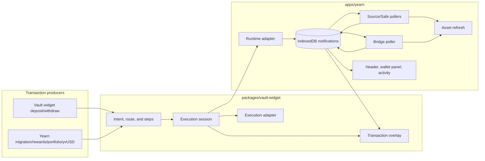
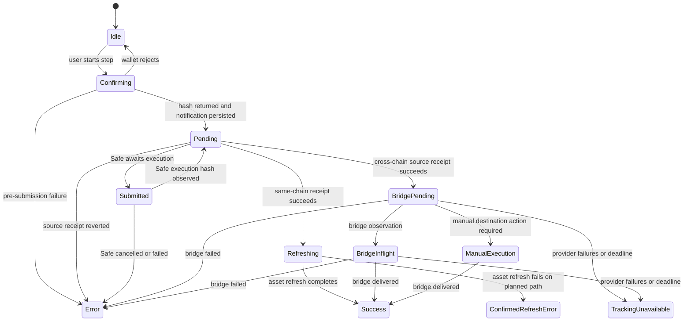
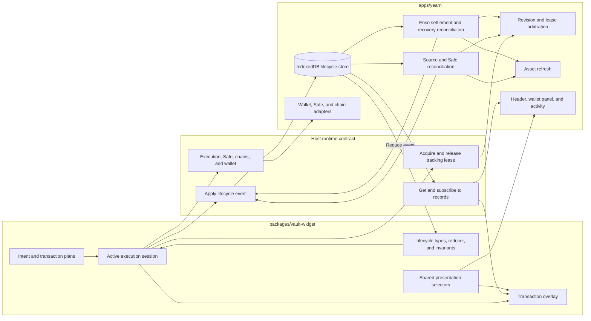
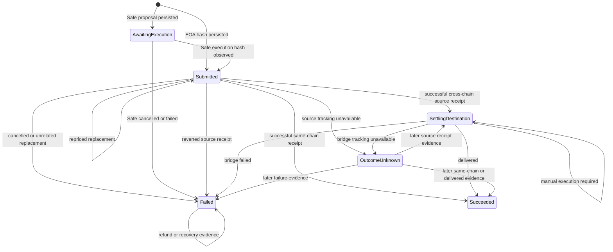

# Transaction Lifecycle

Draft as of 2026-09-08.

## Status

The current-system baseline was verified against [`main` at `afd41bcb`](https://github.com/yearn/yearn.fi/commit/afd41bcb65b4adda364d9d03f76e05e4229fee8e)
on 2026-09-08. The monorepo extraction, vault-widget boundary, Enso cross-chain tracking, router-only Enso policy, and
related cleanup that originally motivated this document are all part of `main`.

The **Current System Map** and **Verified Gaps** describe the merged implementation. The **Target Model**, migration
plan, and TODO-ready specs remain design proposals; they are not claims that the canonical lifecycle reducer,
tracking leases, or unified presentation model have been implemented.

## Goals

- Define where transaction intent, wallet execution, tracking, persistence, and presentation belong.
- Describe the current state machines without treating loosely related status fields as one state.
- Give every lifecycle transition one semantic meaning and one authoritative writer.
- Preserve correct behavior for EOA, Safe, permit, approval, multi-step, Enso, and cross-chain flows.
- Make replacement, reload, timeout, refresh-failure, and concurrent-transaction behavior explicit.
- Provide an incremental migration plan with pass/fail acceptance criteria.

## Non-goals

- Redesign deposit or withdrawal route selection.
- Override Enso routing or select a preferred bridge provider. The target assumes every bridge protocol returned by
  Enso's Route API is eligible for execution and must be represented without a closed protocol allowlist.
- Define transaction copy, visual styling, or animation in detail.
- Build a backend transaction indexer. The target remains client-owned and wallet-scoped unless a separate product
  decision changes that boundary.
- Treat a failed balance refresh as evidence that a confirmed transaction failed.

## Terminology

The target model separates concepts that the current code often groups under “transaction.”

### Transaction flow

A `TransactionFlow` is one user intent, such as depositing into a vault, withdrawing through an Enso route, or
migrating a position. A flow may contain zero, one, or several on-chain transactions.

Examples:

- A permit signature followed by one deposit transaction.
- An approval transaction followed by a deposit transaction.
- An unstake transaction followed by a withdrawal transaction.
- A Safe proposal that atomically batches approval and execution calls.

### Transaction record

A `TransactionRecord` represents one wallet submission or Safe proposal and its observable outcome. A cross-chain
record includes both source-chain confirmation and destination settlement because those observations belong to the
same submitted action.

### Execution session

An `ExecutionSession` is ephemeral UI and wallet state before and during submission. It includes preparation, chain
switching, permit signing, wallet confirmation, and local progress. There is no durable transaction record until a
wallet hash or Safe proposal reference exists.

### Tracking observation

A tracking observation is evidence received after submission: a replacement, Safe status, source receipt, bridge
status, timeout, or provider failure. Failure to observe an outcome is not evidence that the transaction failed.

## Current System Map

### Ownership boundary

The package boundary is documented in
[`packages/vault-widget/README.md`](../packages/vault-widget/README.md#ownership-boundary).

The vault-widget package currently owns:

- Reusable deposit and withdrawal UI.
- Route-specific transaction preparation.
- Transaction steps and the partial headless transaction-plan model.
- Wallet execution through Wagmi or raw preparations.
- The immediate transaction overlay.
- Notification descriptors and notification-runtime calls.

The consuming app currently owns:

- Wagmi, Query, wallet, chain, price, and routing providers.
- Notification persistence and numeric record IDs.
- Safe API lookup.
- Reload-time source-transaction reconciliation.
- Enso bridge-status polling.
- Post-transaction balance refresh.
- Header, wallet-panel, account-activity, and portfolio projections.

The interface between them is `VaultWidgetRuntime`, especially `execution`, `notifications`, `safe`, `chains`, and
`wallet` in [`packages/vault-widget/src/runtime.tsx`](../packages/vault-widget/src/runtime.tsx).



### Current execution paths

| Path | Preparation and execution | Immediate receipt owner | Durable tracking | Replacement-aware |
| --- | --- | --- | --- | --- |
| Ready same-chain, single-request EOA | Headless plan and execution adapter | Plan executor | Yearn notification store and source poller | Yes, during active execution |
| Enso EOA zap | Raw preparation on the legacy overlay | Legacy overlay polling the submitted hash | Yearn source poller, then bridge poller when applicable | No |
| Approval, cross-chain, dynamic unstake, or other legacy EOA flow | Legacy `TransactionStep` | Legacy overlay polling the submitted hash | Yearn notification store and pollers | No |
| Safe flow | Legacy overlay and Safe calls | Overlay Safe lookup, then receipt polling | Yearn Safe/source poller | Not applicable in the same form; Safe cancellation/failure has separate handling |
| Approval-management overlay | `ApprovalOverlay` | Local Wagmi/Safe hooks | None | Not represented in durable history |

The planned path is intentionally limited in
[`plannedTransaction.tsx`](../packages/vault-widget/src/components/widget/shared/plannedTransaction.tsx). It excludes
Safe, cross-chain, approval, permit, batch, Enso, and other uncertain routes. The established path remains in
[`TransactionOverlay.tsx`](../packages/vault-widget/src/components/widget/shared/TransactionOverlay.tsx).

App-specific transaction producers use the package overlay rather than duplicating its execution UI:

- Vault migration: `apps/yearn/src/components/pages/vaults/components/widget/migrate/index.tsx`.
- Rewards: `apps/yearn/src/components/pages/vaults/components/widget/rewards/index.tsx`.
- Portfolio claims: `apps/yearn/src/components/pages/portfolio/index.tsx`.
- yvUSD withdrawal: `apps/yearn/src/components/pages/vaults/components/widget/yvUSD/YvUsdWithdraw.tsx`.

### Current state layers

There are three related but non-identical state layers.

#### 1. Immediate overlay state

The legacy overlay uses:

```ts
type OverlayState = 'idle' | 'confirming' | 'pending' | 'submitted' | 'refreshing' | 'success' | 'error'
```

The planned transaction controller adds error distinctions such as `submitted-unknown-error` and
`confirmed-refresh-error`.

#### 2. Persisted notification state

The Yearn app persists one record with:

```ts
type PersistedNotificationState = {
  status: 'pending' | 'submitted' | 'success' | 'error'
  awaitingExecution?: boolean
  bridgeStatus?: 'pending' | 'inflight' | 'delivered' | 'failed' | 'ready_for_manual_execution' | 'unknown'
  bridgeTrackingState?: 'active' | 'unavailable'
}
```

These fields are independently optional, so the type does not prevent contradictory combinations. The terminal
transition guard in
[`notificationTransitions.ts`](../apps/yearn/src/components/shared/contexts/notificationTransitions.ts) prevents a
settled `success` or `error` from being overwritten by a different terminal status, but it is not a complete state
transition reducer.

#### 3. Presentation state

Header, wallet panel, activity, and overlay presentation derive different meanings from the persisted fields. The
header's `notificationStatus` is the status of the latest mutation, not an aggregate of active records, and it is not
reconstructed when IndexedDB loads.

### Current transition map



`TrackingUnavailable` currently remains persisted as `status: 'submitted'` while also setting `timeFinished`. It
means observation stopped, not that execution or settlement finished.

### Current writers

The same notification can be updated by:

1. The active package overlay or planned controller.
2. One app source/Safe poller per cached notification.
3. The app-wide Enso bridge poller.

The overlay and source poller can observe the same receipt concurrently. Terminal guards and record re-reads reduce
the chance of regression, but ownership remains implicit.

## Verified Gaps To Preserve During Migration

### Legacy replacement tracking

The
[`wagmiExecutionAdapter`](../packages/vault-widget/src/adapters/wagmiExecutionAdapter.ts) records the submitted
transaction identity and returns validated `repriced`, `cancelled`, or `replaced` metadata from `waitForReceipt`. The
plan executor propagates the effective mined hash.

[`useEnsoOrder`](../packages/vault-widget/src/hooks/useEnsoOrder.ts) calls `runtime.execution.execute`, but the raw
preparation returns only the original hash. Because Enso is excluded from the planned path, the legacy overlay then
polls the original hash directly. The app
[`useTransactionStatusPoller`](../apps/yearn/src/components/shared/hooks/useTransactionStatusPoller.ts) also polls only
the persisted hash. A wallet Speed Up or Cancel can therefore leave the overlay and durable record pending.

This is a broader legacy EOA limitation, not an Enso-only state-model problem. Enso makes the gap deterministic
because every Enso route remains on the legacy path.

### Concurrent bridge fairness

The app polls one bridge record every ten seconds.
[`selectNextEnsoBridgeNotification`](../apps/yearn/src/components/shared/hooks/ensoBridgeStatus.ts) sorts by newest
source confirmation first and uses `lastBridgeCheckAt` only as a tie-breaker. An older bridge is not checked again
until the newer bridge becomes untrackable, settles, or reaches the tracking deadline.

### Incomplete Enso settlement evidence

The current route and notification types recognize only Stargate, CCIP, and Relay. Enso also documents CCTP and may
change which bridge protocol its Route API selects. Because Yearn delegates route selection to Enso, the lifecycle
model cannot use a closed protocol union as an execution or tracking boundary.

The current status projection also reduces settlement to one protocol, one destination hash, and one terminal
status. That loses evidence Enso may return for ordered multi-hop settlement, destination callback failure, manual
execution, and refunds. In particular, the Relay fallback currently normalizes both `refund` and `refunded` to
`failed`, which describes the requested action but not where the funds ended up.

### Notification indicator semantics

The header indicator reflects the latest in-memory add or status-bearing update in
[`useNotifications`](../apps/yearn/src/components/shared/contexts/useNotifications.tsx). It can disappear after reload,
be cleared by a metadata-only update, or show a recent success while another record is active.

### Approval-management history

The
[`ApprovalOverlay`](../packages/vault-widget/src/components/widget/deposit/ApprovalOverlay.tsx) has its own state
machine but does not use the notification runtime. Revoke and set-unlimited transactions are therefore absent from
durable activity. Whether that is desired product behavior must be decided explicitly.

### Refresh and transaction outcome

A confirmed successful receipt is transaction evidence. Balance refresh is a downstream side effect. A refresh
failure may require a warning or retry, but must never rewrite the transaction outcome as failed or invite the user to
resubmit blindly.

## Target Model

### Design principles

1. **Model flows and transactions separately.** One intent may create several on-chain records.
2. **Persist evidence, not UI labels.** Presentation states are selectors over canonical records.
3. **Use one reducer for every durable transition.** Pollers and overlays emit events; they do not merge arbitrary
   partial records.
4. **Give tracking one lease owner at a time.** Active execution and background reconciliation must not race as
   independent authorities.
5. **Separate outcome from observability.** Tracking unavailability is not failure.
6. **Retain original and effective transaction identities.** Repricing updates the effective hash without erasing the
   submitted hash.
7. **Make transitions idempotent and monotonic.** Repeated observations must be safe; weaker evidence cannot regress
   stronger evidence.
8. **Treat refresh as a post-confirmation effect.** It can fail independently of the transaction.
9. **Keep the package host-agnostic.** The package defines the event contract; the host supplies persistence and
   trackers.
10. **Preserve safe disconnected defaults.** A constrained consumer may use in-memory/no-op persistence while still
    receiving correct active-session UI.
11. **Treat the Enso-selected protocol as data.** Persist every bridge leg and its protocol identifier without a
    closed allowlist. Provider-specific tracking enriches the common settlement contract rather than defining which
    routes are valid.
12. **Separate requested outcome from fund disposition.** A zap can fail while funds are refunded or recoverable;
    presentation and reconciliation must preserve both facts.

### Target ownership

The proposal refines the boundary without changing its dependency direction: consuming apps depend on the package,
while the package remains independent of app code. The package owns lifecycle semantics and active execution; the
host owns lifecycle infrastructure, external reconciliation services, and product presentation.



#### Vault widget package

- Define `TransactionFlow`, `TransactionRecord`, lifecycle events, and the pure reducer in a framework-independent
  entry point.
- Build transaction intents and execution steps.
- Execute active wallet steps through the execution adapter.
- Hold the active tracking lease while it can perform replacement-aware observation.
- Emit typed lifecycle events through the host runtime.
- Render overlay state from execution-session state plus the canonical transaction projection.
- Never depend on IndexedDB, Yearn contexts, Safe HTTP endpoints, or Enso status endpoints directly.

#### Yearn app

- Allocate durable flow and transaction IDs.
- Persist lifecycle records and/or events scoped to the connected owner address.
- Apply every event through the canonical reducer with optimistic revision checks.
- Arbitrate active-session and background-reconciler tracking leases.
- Resume eligible source, Safe, Enso settlement, and recovery tracking after reload.
- Perform asset refresh and record its diagnostic result without changing transaction outcome.
- Derive header, wallet panel, and activity views from shared selectors.

#### Other hosts

- May provide in-memory lifecycle storage for session-only behavior.
- Must supply durable persistence and resumption services if they promise transaction history across reloads.
- Must not need Yearn-specific notification or activity types.

#### Target runtime seam

The current `notifications.createSubmitted`, `notifications.update`, and `notifications.get` surface should migrate to
an event-oriented contract. Exact naming may change during implementation, but the required capabilities are:

```ts
type VaultWidgetTransactionLifecycleRuntime = {
  allocateId: (kind: 'flow' | 'transaction' | 'event') => string
  applyEvent: (
    event: TransactionLifecycleEvent,
    options?: { expectedRevision?: number }
  ) => Promise<TransactionRecord>
  getRecord: (transactionId: string) => TransactionRecord | undefined
  subscribe: (listener: (transactionId: string) => void) => () => void
  acquireTrackingLease: (input: {
    transactionId: string
    owner: TransactionTrackingLease['owner']
    ownerInstanceId: string
    stage: TransactionTrackingLease['stage']
    ttlMs: number
  }) => Promise<TransactionTrackingLease | undefined>
  releaseTrackingLease: (lease: TransactionTrackingLease) => Promise<void>
}
```

`allocateId` does not by itself create durable history. The first `transaction_submitted` event creates the record.
The runtime may keep flow metadata in memory before submission and persist it with the first child transaction.

### Execution-session state

Pre-submission behavior is ephemeral and local to the active flow:

```ts
type ExecutionSessionState =
  | { phase: 'idle' }
  | { phase: 'preparing'; flowId: string; stepId: string }
  | { phase: 'switching_chain'; flowId: string; stepId: string; targetChainId: number }
  | { phase: 'signing_permit'; flowId: string; stepId: string }
  | { phase: 'confirming_wallet'; flowId: string; stepId: string }
  | { phase: 'submitted'; flowId: string; stepId: string; transactionId: string }
  | { phase: 'rejected'; flowId: string; stepId: string }
  | { phase: 'failed_before_submission'; flowId: string; stepId: string; error: TransactionLifecycleError }
```

Wallet rejection does not create a `TransactionRecord`. It may emit analytics, but it is not transaction history.

### Durable submission references

```ts
type EoaSubmissionReference = {
  kind: 'eoa'
  chainId: number
  originalHash: `0x${string}`
  effectiveHash: `0x${string}`
  replacements: Array<{
    replacedHash: `0x${string}`
    replacementHash: `0x${string}`
    reason: 'repriced' | 'cancelled' | 'replaced'
    observedAt: number
  }>
  identity?: {
    from: `0x${string}`
    nonce: number
    to: `0x${string}`
    value: string
    data: `0x${string}`
  }
}

type SafeSubmissionReference = {
  kind: 'safe'
  chainId: number
  proposalId: `0x${string}`
  executionHash?: `0x${string}`
}
```

Persisting the EOA identity makes replacement recovery possible after the active in-memory adapter session is lost.
If persisting full call data is rejected, replacement recovery after reload must remain an explicit limitation rather
than being described as supported.

### Durable transaction state

Canonical evidence uses transaction-domain terms rather than UI copy:

```ts
type TransactionReceiptEvidence = {
  chainId: number
  transactionHash: `0x${string}`
  blockNumber: string
  status: 'success' | 'reverted'
  confirmedAt: number
}

type EnsoBridgeStatus =
  | 'pending'
  | 'inflight'
  | 'delivered'
  | 'failed'
  | 'ready_for_manual_execution'
  | 'unknown'

type BridgeRefundAsset = {
  legIndex?: number
  protocol: string
  chainId: number
  token: `0x${string}`
  recipient: `0x${string}`
  symbol?: string
}

type SettlementCallbackEvidence = {
  status: 'not_applicable' | 'pending' | 'succeeded' | 'failed'
  transactionHash?: `0x${string}`
  error?: string
}

type SettlementRecoveryEvidence = {
  kind: 'manual_execution' | 'provider_refund' | 'callback_refund'
  status: 'available' | 'pending' | 'completed'
  legIndex?: number
  chainId?: number
  transactionHash?: `0x${string}`
  token?: `0x${string}`
  amount?: string
  recipient?: `0x${string}`
  instructions?: string
}

type SettlementLegEvidence = {
  index: number
  protocol: string
  sourceChainId: number
  destinationChainId: number
  status: EnsoBridgeStatus
  observedAt: number
  requestId?: `0x${string}`
  sourceTransactionHash?: `0x${string}`
  destinationTransactionHash?: `0x${string}`
  callback?: SettlementCallbackEvidence
  error?: string
  providerDetails?: Record<string, unknown>
}

type SettlementEvidence = {
  provider: 'enso'
  status: EnsoBridgeStatus
  observedAt: number
  legs: SettlementLegEvidence[]
  refundAssets: BridgeRefundAsset[]
  recoveries: SettlementRecoveryEvidence[]
  error?: string
}

type TransactionFailureReason =
  | 'wallet_cancelled'
  | 'wallet_replaced'
  | 'safe_cancelled'
  | 'safe_failed'
  | 'source_reverted'
  | 'settlement_failed'

type TrackingUnavailableEvidence = {
  unavailableSince: number
  reason: string
  lastCheckedAt?: number
}

type TransactionLifecycleError = {
  code: string
  message: string
  recoverability: 'retry_step' | 'check_explorer' | 'none'
}
```

```ts
type TransactionLifecycleState =
  | {
      phase: 'submitted'
      submission: EoaSubmissionReference | Required<SafeSubmissionReference>
    }
  | {
      phase: 'awaiting_execution'
      submission: SafeSubmissionReference
      safeStatus: 'awaiting_confirmations' | 'awaiting_execution'
    }
  | {
      phase: 'settling_destination'
      submission: EoaSubmissionReference | Required<SafeSubmissionReference>
      sourceReceipt: TransactionReceiptEvidence
      settlement: SettlementEvidence
    }
  | {
      phase: 'succeeded'
      submission: EoaSubmissionReference | Required<SafeSubmissionReference>
      sourceReceipt: TransactionReceiptEvidence
      settlement?: SettlementEvidence
      finishedAt: number
    }
  | {
      phase: 'failed'
      submission: EoaSubmissionReference | SafeSubmissionReference
      stage: 'submission' | 'safe_execution' | 'source_execution' | 'destination_settlement'
      reason: TransactionFailureReason
      evidence?: TransactionReceiptEvidence | SettlementEvidence
      finishedAt: number
    }
  | {
      phase: 'outcome_unknown'
      submission: EoaSubmissionReference | SafeSubmissionReference
      stage: 'source_execution' | 'destination_settlement'
      lastKnownEvidence?: TransactionReceiptEvidence | SettlementEvidence
      tracking: TrackingUnavailableEvidence
    }
```

`outcome_unknown` is not a failed transaction. It can later transition to `settling_destination`, `succeeded`, or
`failed` if stronger evidence becomes available.

The record envelope carries identity, intent metadata, revision, and settlement requirements separately from the
discriminated lifecycle state:

```ts
type SettlementRequirement =
  | { kind: 'same_chain' }
  | {
      kind: 'bridge'
      provider: 'enso'
      sourceChainId: number
      destinationChainId: number
      routeRequestId?: string
      legs: Array<{
        index: number
        protocol: string
        sourceChainId: number
        destinationChainId: number
      }>
      refundAssets: BridgeRefundAsset[]
      estimatedDeliveryMs?: number
    }

type TransactionRecord = {
  schemaVersion: 1
  id: string
  flowId: string
  stepId: string
  ownerAddress: `0x${string}`
  type: string
  createdAt: number
  revision: number
  settlementRequirement: SettlementRequirement
  state: TransactionLifecycleState
  trackingLease?: TransactionTrackingLease
  effects?: {
    assetRefresh?: 'not_started' | 'pending' | 'succeeded' | 'failed'
  }
}
```

`settlementRequirement` is fixed when the record is created. It lets a successful source receipt transition directly
to `succeeded` for same-chain execution or `settling_destination` for a bridge without introducing an ambiguous
intermediate state.

For an Enso route, `protocol` is the normalized, non-empty identifier returned by Enso. Values such as `stargate`,
`ccip`, `cctp`, and `relay` are currently known examples, not an exhaustive union and not an acceptance allowlist.
Protocol identifiers must be validated as bounded path-safe data before a server uses one to construct a bridge-status
request.

`SettlementRequirement.legs` is the ordered route-time plan and is immutable. `SettlementEvidence.legs` may be
enriched as provider observations arrive. `delivered` is valid only when Enso provides authoritative overall delivery
or every reported required leg and destination callback has completed; no known leg or callback may contradict that
outcome. An empty or partially described route-time plan must remain trackable and retain the original Enso metadata;
it must not be silently treated as a same-chain transaction.

`providerDetails` is a bounded, versioned snapshot for evidence that is not common across bridges, such as CCIP
finality, CCTP attestation or forwarding state, Relay refund references, and Stargate hop state. It must not contain
secrets or unbounded provider responses.

### Enso execution and settlement contract

The target follows Enso's documented [Route API](https://docs.enso.build/pages/build/get-started/route),
[cross-chain routing](https://docs.enso.build/pages/build/get-started/crosschain-routing),
[routing strategies](https://docs.enso.build/pages/build/reference/routing-strategies), and
[bridge-status API](https://docs.enso.build/pages/build/get-started/bridge-status):

- Enso selects the route and bridge protocol. Yearn does not prefer or reject a route because of the protocol name.
- A same-chain route is one atomic source-chain transaction.
- A cross-chain route has a source transaction and asynchronous destination settlement. Destination failure cannot
  revert a finalized source bridge.
- The returned Enso transaction's `to`, `data`, and `value` are submitted unchanged. Any required approval is a
  separate transaction record in the same flow.
- Route `amountOut` and delivery estimates are expected values, never proof of realized output or settlement.
- Route-time bridge legs, refund assets, request ID, and delivery estimate are captured before wallet submission and
  persisted atomically with the first `transaction_submitted` event.
- `delivered` means the required destination delivery and callback succeeded. `failed` can describe bridge or callback
  failure and does not by itself establish whether funds were refunded, recoverable, or lost.
- `ready_for_manual_execution` remains nonterminal. The flow becomes `awaiting_user_action`, and any user-submitted
  claim, retry, or recovery transaction becomes another child transaction record.
- Refund and recovery observations can continue after the requested action enters `failed`; they enrich fund
  disposition without rewriting the failed product outcome as success.

The settlement reducer derives overall status independently from `recoveries`. `ready_for_manual_execution` takes
presentation priority over pending states, while an authoritative `failed` or `delivered` observation determines the
requested action's terminal outcome. Refund availability or completion changes the recovery presentation only; it
does not convert a failed zap into a delivered zap.

### Target transition map



### Flow state

Flow metadata groups an ordered user intent without pretending that every step is an on-chain transaction:

```ts
type TransactionFlow = {
  id: string
  ownerAddress: `0x${string}`
  type: string
  createdAt: number
  steps: Array<{
    id: string
    kind: 'signature' | 'transaction' | 'effect'
    label: string
    transactionIds: string[]
  }>
}
```

Flow state is derived from its steps, child transaction records, and the active execution session. It should not be
independently mutated.

```ts
type TransactionFlowState =
  | 'not_started'
  | 'active'
  | 'awaiting_user_action'
  | 'settling'
  | 'succeeded'
  | 'partially_succeeded'
  | 'failed'
  | 'outcome_unknown'
```

Examples:

- A successful approval followed by a rejected deposit is `partially_succeeded`, not simply `failed`.
- A permit signature is a completed execution step but not a `TransactionRecord`.
- A bridge awaiting manual destination execution is `awaiting_user_action`.

### Lifecycle event contract

Every durable update uses an event envelope:

```ts
type TransactionLifecycleEvent = {
  eventId: string
  transactionId: string
  flowId: string
  stepId: string
  ownerAddress: `0x${string}`
  observedAt: number
  source: 'active_execution' | 'source_reconciler' | 'safe_reconciler' | 'bridge_reconciler' | 'manual_reconcile'
  payload: TransactionLifecycleEventPayload
}
```

Initial payload set:

```ts
type TransactionLifecycleEventPayload =
  | {
      type: 'transaction_submitted'
      transactionType: string
      settlementRequirement: SettlementRequirement
      submission: EoaSubmissionReference | SafeSubmissionReference
    }
  | {
      type: 'transaction_replacement_observed'
      reason: 'repriced' | 'cancelled' | 'replaced'
      replacedHash: `0x${string}`
      effectiveHash: `0x${string}`
    }
  | { type: 'safe_status_observed'; status: VaultWidgetSafeTransactionStatus; executionHash?: `0x${string}` }
  | { type: 'source_receipt_confirmed'; receipt: TransactionReceiptEvidence }
  | { type: 'source_receipt_reverted'; receipt: TransactionReceiptEvidence }
  | { type: 'settlement_status_observed'; settlement: SettlementEvidence }
  | {
      type: 'tracking_unavailable'
      stage: 'source_execution' | 'destination_settlement' | 'recovery'
      reason: string
    }
```

Asset-refresh results are effects associated with a transaction ID, not lifecycle transitions:

```ts
type TransactionEffectObservation =
  | { type: 'asset_refresh_started'; transactionId: string; observedAt: number }
  | { type: 'asset_refresh_succeeded'; transactionId: string; observedAt: number }
  | { type: 'asset_refresh_failed'; transactionId: string; observedAt: number; message: string }
```

### Transition table

| From | Event | To | Authoritative observer |
| --- | --- | --- | --- |
| No record | `transaction_submitted` with EOA reference | `submitted` | Active execution |
| No record | `transaction_submitted` with Safe reference | `awaiting_execution` | Active execution |
| `submitted` | Repriced replacement | `submitted`, with updated effective hash | Active execution or identity-aware reconciler |
| `submitted` | Cancelled or unrelated replacement | `failed` | Active execution or identity-aware reconciler |
| `awaiting_execution` | Safe execution hash observed | `submitted` | Safe reconciler |
| `awaiting_execution` | Safe cancelled or failed | `failed` | Safe reconciler |
| `submitted` | Successful source receipt, same-chain | `succeeded` | Current tracking lease owner |
| `submitted` | Successful source receipt, cross-chain | `settling_destination` | Current tracking lease owner |
| `submitted` | Reverted source receipt | `failed` | Current tracking lease owner |
| `submitted` | Source tracking unavailable | `outcome_unknown` | Source reconciler |
| `settling_destination` | Pending, inflight, or unknown status | `settling_destination` with newer evidence | Bridge reconciler |
| `settling_destination` | Ready for manual execution | `settling_destination`; enclosing flow is `awaiting_user_action` | Bridge reconciler |
| `settling_destination` | Delivered | `succeeded` | Bridge reconciler |
| `settling_destination` | Failed | `failed` | Bridge reconciler |
| `settling_destination` | Tracking unavailable | `outcome_unknown` | Bridge reconciler |
| `outcome_unknown` | Stronger receipt or settlement evidence | `settling_destination`, `succeeded`, or `failed` | Reconciler or manual reconcile |
| `failed` | New refund or recovery evidence | `failed` with enriched fund disposition | Bridge reconciler or manual reconcile |
| `succeeded` or `failed` | Repeated equivalent evidence | Unchanged | Any reconciler |

### Invariants

The reducer must enforce:

1. A record is always scoped to one `ownerAddress`, `flowId`, and `stepId`.
2. `originalHash` is immutable.
3. `effectiveHash` changes only with validated replacement evidence.
4. Receipt hashes must equal the effective hash or be accompanied by validated replacement evidence.
5. `succeeded` requires a successful source receipt and, when applicable, evidence that every required settlement leg
   and destination callback was delivered.
6. `failed` requires wallet replacement, Safe, receipt, or settlement evidence. Provider timeout alone is insufficient.
7. `finishedAt` exists only for `succeeded` and `failed`.
8. `outcome_unknown` retains the last known evidence and may be resolved later.
9. Repeated events are idempotent by `eventId` and semantic evidence identity.
10. A stale event cannot regress stronger evidence.
11. Only the current tracking lease owner may emit active source-observation events.
12. Refresh success or failure cannot alter lifecycle phase.
13. A transaction record is created only after a hash or Safe proposal reference exists.
14. Multi-step flow outcome is derived from child steps and records.
15. A bridge protocol identifier is route data, not a closed enum and not a reason to reject an Enso-selected route.
16. Settlement outcome and recovery disposition are independent. Later refund or recovery evidence may enrich a
    failed record without changing its phase to `succeeded`.
17. Any route with cross-chain execution has a bridge settlement requirement, even if its route-time leg metadata is
    incomplete.
18. Settlement-leg updates merge by stable leg index and cannot erase hashes, callback evidence, or recovery evidence
    already observed for another leg.

### Tracking ownership and leases

Active replacement detection needs wallet submission identity that currently exists only in the in-memory execution
adapter. Background reconciliation needs to resume after navigation or reload. Both are required, but they must not
poll and write concurrently without coordination.

Recommended record metadata:

```ts
type TransactionTrackingLease = {
  transactionId: string
  owner: 'active_execution' | 'background_reconciler'
  ownerInstanceId: string
  stage: 'source_execution' | 'destination_settlement' | 'recovery'
  acquiredAt: number
  expiresAt: number
  revision: number
}
```

Rules:

- Active execution acquires the lease when the submission is persisted.
- It renews the lease while its replacement-aware receipt wait is alive.
- Background reconciliation ignores an unexpired active lease.
- Closing, navigation, crash, or lease expiry allows the background reconciler to take over.
- `ownerInstanceId` prevents two tabs or two mounted coordinators from treating the same logical owner type as one
  lease holder.
- Every event application compares the record revision and retries from the latest state on conflict.
- Source and destination settlement use separate lease stages. Bridge tracking begins only after successful source
  receipt evidence and is independently fair across records.
- A failed record with pending or available recovery evidence remains eligible for a `recovery` lease until recovery
  completes or tracking becomes unavailable.

### Fair bridge scheduling

Among trackable bridge records, select:

1. Records never checked before.
2. Otherwise the least recently checked record.
3. Use source-confirmation time and record ID only as deterministic tie-breakers.

The bridge-status API has a global budget of one request per ten seconds per Enso API key or IP. The host must enforce
that budget across records and browser tabs; per-record intervals are insufficient. Route delivery estimates and
provider finality evidence may set a later `nextEligibleCheckAt`, but they must not let one record starve another.
Bounded concurrency is valid only if Enso's documented global budget changes or separate capacity is explicitly
available.

### Presentation selectors

All surfaces should share selectors over canonical flow and transaction records.

Minimum selectors:

- `selectTransactionPresentation(record)` — title, description, severity, explorer links, and available action.
- `selectFlowState(flow, records)` — derived aggregate flow state.
- `selectWalletIndicator(records)` — aggregate wallet status.
- `selectRecentActivity(records)` — consistently ordered activity rows.
- `selectTrackableSourceRecords(records, now)` — background source candidates.
- `selectTrackableSettlementRecords(records, now)` — fair settlement candidates.

Wallet-indicator priority should be explicit:

1. Any active or awaiting-user-action flow.
2. Any unresolved `outcome_unknown` flow.
3. A recent failure that has not been acknowledged.
4. A recent success within the product-defined display window.
5. No indicator.

Metadata-only updates must not clear the aggregate indicator.

### Observability

Every warning or metric should include, when available:

- `transactionId`, `flowId`, and `stepId`.
- Owner address in a privacy-appropriate form.
- Canonical and execution chain IDs.
- Submission kind and original/effective hash.
- Lifecycle phase and record revision.
- Tracking lease owner.
- Settlement leg index, opaque bridge protocol identifier, and bridge request ID.
- Settlement status, callback status, and recovery disposition.
- Event source and event ID.

Recommended counters:

- Submitted records by flow type and submission kind.
- Replacement outcomes by reason.
- Time from submission to source confirmation.
- Time from source confirmation to destination settlement.
- Settlement and recovery outcomes by Enso-selected protocol identifier.
- Manual-execution actions surfaced and later completed.
- Refunds observed after a failed bridge or callback.
- Records entering and later leaving `outcome_unknown`.
- Tracking lease takeovers and revision conflicts.
- Asset-refresh failures after confirmed success.
- Durable persistence failures after wallet submission.

Do not include full calldata in remote logs.

## Migration Plan

### Phase 0 — Characterize and document

- Land this specification.
- Add a current-path matrix to regression tests.
- Confirm the product decisions in Questions and Assumptions.
- Do not change runtime behavior.

### Phase 1 — Close current reliability gaps

- Make legacy EOA receipt handling replacement-aware, starting with raw Enso routes.
- Accept every path-safe protocol identifier returned by Enso and add CCTP status tracking.
- Preserve route-time bridge metadata and refund/recovery evidence through the existing compatibility record.
- Change bridge scheduling from newest-first to least-recently-checked.
- Derive the header indicator from all cached records.
- Preserve the existing notification schema during this phase.

### Phase 2 — Introduce canonical types and reducer

- Add framework-independent lifecycle types, reducer, and selectors to the package.
- Add reducer table tests for every allowed and rejected transition.
- Implement a compatibility adapter that projects canonical records into the current notification shape.
- Keep the current UI and IndexedDB schema working behind the adapter.

### Phase 3 — Establish single-writer tracking

- Add transaction record revisions and tracking leases.
- Route active overlay, source, Safe, and bridge observations through lifecycle events.
- Persist replacement identity required for reload recovery, or document the chosen limitation.
- Stop direct partial-record merges from pollers.

### Phase 4 — Migrate presentation and flows

- Migrate overlay, header, wallet panel, account activity, and portfolio activity to shared selectors.
- Represent multi-step user intents as flows with child transaction records.
- Decide and implement approval-management history policy.
- Extend headless plans until Enso, Safe, cross-chain, approval, and dynamic multi-step flows no longer require a
  separate lifecycle implementation.

### Phase 5 — Remove compatibility state

- Remove the duplicated package/app notification status types.
- Remove legacy notification partial-update APIs.
- Migrate or read old IndexedDB rows through a versioned compatibility decoder.
- Retain explorer access and clear outcome wording for legacy rows that cannot be fully reconstructed.

## TODO-Ready Specs

### TODO 1 — Make legacy EOA tracking replacement-aware

**Priority:** P1

**Effort:** M

**Risk:** Medium

#### Context

Legacy EOA submissions use exact-hash receipt polling. Enso is always routed through this path, while validated
replacement handling exists only in the planned execution adapter.

#### Goals

- Continue a repriced transaction under its mined effective hash.
- Set cancellation and unrelated replacement to explicit terminal failure states.
- Update the durable transaction reference before settlement or refresh.
- Cover raw Enso and prepared legacy contract execution.

#### Non-goals

- Migrate every legacy flow to the headless planner in the same change.
- Add reload-time replacement recovery unless submission identity is persisted.

#### Proposed approach

- Route every legacy EOA submission through a replacement-aware execution-session tracker.
- Return submission evidence rather than an unstructured hash when necessary.
- Reuse the adapter's validation rules for repriced, cancelled, and unrelated replacements.
- Persist original and effective hashes separately.

#### Acceptance criteria

- Speeding up an Enso zap updates the tracked hash and completes from the replacement receipt.
- Speeding up a non-Enso legacy EOA transaction behaves identically.
- Wallet cancellation ends as failed/cancelled and never refreshes balances or reports success.
- An unrelated same-nonce replacement ends as failed/replaced.
- A receipt for an unexpected hash without replacement evidence is rejected.
- Existing planned-path replacement tests remain green.

#### Test plan

- Unit tests for replacement normalization and record transitions.
- Overlay/controller tests for Enso raw and legacy prepared submissions.
- Manual wallet QA for Speed Up and Cancel on a Tenderly-backed network.
- Verify that the notification/activity link uses the effective hash.

### TODO 2 — Preserve complete Enso settlement evidence

**Priority:** P1

**Effort:** M

**Risk:** High

#### Context

Enso chooses the bridge protocol. The current route parser and notification schema recognize only Stargate, CCIP,
and Relay, take the first bridge step, and flatten refunds into failure. A route selected by Enso can therefore execute
without enough durable data to explain or reconcile its settlement.

#### Goals

- Accept every Enso-selected bridge protocol without a closed client-side protocol union.
- Persist ordered bridge legs, route estimates, refund assets, callbacks, and recovery evidence.
- Keep requested outcome, tracking availability, and fund disposition distinct.
- Support protocol-specific evidence without leaking provider shapes into lifecycle transitions.

#### Proposed approach

- Replace closed protocol unions with a validated, bounded protocol identifier returned by Enso.
- Capture all bridge steps and available `metadata.bridgeRefundAssets` and `bridgingEstimates` when the route becomes
  executable.
- Proxy the common Enso `/{protocol}/bridge/check` contract for path-safe protocol identifiers; add explicit enrichers
  for known protocol evidence without making that registry an execution allowlist.
- Normalize the shared Enso status, then merge leg, callback, refund, and recovery evidence monotonically.
- Keep a failed record eligible for recovery reconciliation while a refund or manual action remains pending.

#### Acceptance criteria

- CCTP, CCIP, Relay, Stargate, and an unknown path-safe protocol identifier all create bridge settlement requirements.
- An unknown protocol never becomes `same_chain`, disappears from tracking, or fails merely because it is not in a
  frontend enum.
- A multi-hop response preserves every reported leg and transaction hash in order.
- `delivered` requires all required legs and callbacks; CCTP may explicitly record a callback as `not_applicable`.
- `ready_for_manual_execution` surfaces an actionable nonterminal state with protocol-specific instructions.
- Relay and callback refunds retain refund chain, transaction, token, amount, and recipient evidence when supplied.
- A completed refund enriches a failed transaction and changes its presentation without relabeling the requested zap
  as successful.
- Provider errors or an unavailable protocol status endpoint lead to `outcome_unknown`, never `failed`.

#### Test plan

- Route-normalization fixtures for the four currently documented protocols, an unknown protocol, multiple bridge
  legs, refund assets, and delivery estimates.
- Status-normalization fixtures for delivery, callback failure, CCTP manual claim, Relay refund, and Stargate
  multi-hop settlement.
- Reducer tests for monotonic leg merging and recovery evidence arriving after terminal failure.
- Integration test proving route execution does not depend on membership in a bridge-protocol allowlist.

### TODO 3 — Make bridge scheduling fair

**Priority:** P1

**Effort:** S

**Risk:** Low

#### Context

The bridge poller chooses the newest active record until it settles, starving older concurrent records.

#### Goals

- Give every trackable bridge bounded opportunities to be checked.
- Preserve one-request-at-a-time polling initially.
- Keep scheduling deterministic and testable.

#### Proposed approach

- Sort never-checked records first, then `lastBridgeCheckAt` ascending.
- Use source-confirmation time and ID as deterministic tie-breakers.
- Update `lastBridgeCheckAt` on successful and failed checks.

#### Acceptance criteria

- Two active bridges alternate checks over successive intervals.
- Adding a newer bridge does not prevent an older bridge from being selected next when the older record was checked
  less recently.
- Delivered and tracking-unavailable records are excluded from settlement polling. Failed records are excluded unless
  they have pending recovery evidence, in which case they are scheduled through the separate recovery stage.
- The global one-request-per-ten-seconds budget and outcome-unknown timeout semantics remain unchanged.

#### Test plan

- Pure selector tests for zero, one, two, and many candidates.
- Hook test covering successive intervals and record updates.
- Manual QA with two concurrent cross-chain submissions if a reliable test route is available.

### TODO 4 — Add the canonical lifecycle reducer

**Priority:** P1

**Effort:** L

**Risk:** Medium

#### Context

Overlay and app pollers currently merge partial notification fields independently. Contradictory states are
representable, and lifecycle meaning is distributed across consumers.

#### Goals

- Define one discriminated durable transaction state.
- Apply every update through typed events and a pure reducer.
- Reject invalid, stale, or weaker transitions.
- Preserve current consumers through a compatibility projection.

#### Non-goals

- Replace IndexedDB immediately.
- Redesign user-facing transaction copy in the reducer change.

#### Proposed approach

- Add lifecycle types, event types, reducer, and selectors under the package headless/public boundary.
- Store a monotonically increasing record revision.
- Add a compatibility projection to the current notification type.
- Migrate writers one at a time without changing presentation initially.

#### Acceptance criteria

- Every transition in the target transition table has a passing reducer test.
- Invalid combinations cannot be constructed through the reducer.
- Duplicate events are idempotent.
- Terminal outcomes cannot regress.
- `outcome_unknown` can resolve when stronger evidence arrives.
- Asset-refresh events cannot change transaction phase.
- The package implementation imports no app code.

#### Test plan

- Table-driven reducer unit tests.
- Property tests for idempotence and terminal monotonicity if the repository accepts the required tooling; otherwise
  deterministic generated cases without a new dependency.
- Compatibility projection snapshots for current wallet/activity presentation.
- Package-boundary check and both app type checks.

### TODO 5 — Establish tracking leases and revision-safe persistence

**Priority:** P1

**Effort:** L

**Risk:** High

#### Context

The active overlay and app background poller may observe and update the same source transaction concurrently.
Replacement identity is currently available only to the active adapter session.

#### Goals

- Ensure one active source tracker per transaction record.
- Support safe takeover after navigation, reload, or crashed execution.
- Prevent stale observations from overwriting newer evidence.

#### Proposed approach

- Add record revisions and expiring tracking leases.
- Let active execution hold and renew the first lease.
- Let the background reconciler acquire only expired or explicitly released leases.
- Compare revisions when applying events and retry against the latest record on conflict.
- Persist enough submission identity for the agreed replacement-recovery guarantee.

#### Acceptance criteria

- The background poller does not request receipts while an active lease is valid.
- It takes over after lease expiry or explicit release.
- Two attempted writers cannot regress or duplicate a transition.
- Reload resumes pending Safe, source, and bridge records.
- The chosen post-reload replacement guarantee is documented and tested.

#### Test plan

- Fake-clock lease acquisition, renewal, expiry, and takeover tests.
- Revision-conflict integration tests with two simulated writers.
- Reload integration tests for EOA, Safe, and bridge records.
- Manual navigation/reload QA during a pending transaction.

### TODO 6 — Migrate transaction presentation to shared selectors

**Priority:** P2

**Effort:** M

**Risk:** Medium

#### Context

Header, wallet panel, portfolio, account activity, and overlay currently interpret notification fields independently.

#### Goals

- Make all surfaces agree on active, unknown, succeeded, and failed outcomes.
- Make the wallet indicator aggregate all relevant records.
- Preserve access to source and destination explorer links.

#### Proposed approach

- Implement the minimum selector set defined above.
- Migrate one presentation surface at a time.
- Add an acknowledgement/display-window policy for terminal indicators outside the lifecycle reducer.

#### Acceptance criteria

- Reloading with an active transaction restores an active header indicator.
- A metadata-only update cannot clear the indicator.
- Active work takes priority over a newer success indicator.
- Tracking unavailable is presented as outcome unknown, not failed or completed.
- Wallet panel and portfolio activity use the same terminal classification.

#### Test plan

- Selector table tests with multiple simultaneous records.
- Component tests for header and wallet panel.
- Reload QA with seeded IndexedDB records.

### TODO 7 — Decide and implement approval transaction policy

**Priority:** P2

**Effort:** S or M, depending on policy

**Risk:** Low

#### Context

Approval steps inside flows can be notified, but revoke/set-unlimited transactions from `ApprovalOverlay` are local
only.

#### Decision required

Choose one:

1. Treat every on-chain approval change as a transaction record and include it in activity.
2. Persist approval-management records but hide them from default activity unless expanded.
3. Explicitly keep approval management session-only and document that limitation.

#### Acceptance criteria

- The selected policy is documented.
- Approval-management behavior is consistent for EOA and Safe wallets.
- If persisted, reload and explorer links work like other transaction records.
- If excluded, the UI does not imply that all on-chain widget actions appear in activity.

## Questions And Assumptions

1. Should approval-management transactions appear in default activity, an expanded technical view, or nowhere?
2. Is persisting public transaction identity (`from`, nonce, `to`, value, calldata) in local IndexedDB acceptable for
   replacement recovery after reload?
3. Should `outcome_unknown` remain indefinitely visible until acknowledged, or age into archived activity while still
   retaining its unresolved meaning?
4. Does the standalone yBOLD app need durable transaction history, or is active-session tracking sufficient?
5. Should the long-term durable store keep an append-only event log, or only the reduced record plus a bounded recent
   event history? This spec supports either, provided event application is idempotent and revision-safe.

Recommended starting defaults, subject to product confirmation:

- Persist approval-management transactions but hide them from default activity unless the user expands technical
  activity.
- Persist replacement identity only in local IndexedDB, never remote analytics or logs.
- Keep `outcome_unknown` semantically unresolved even if the user acknowledges it or it moves into archived activity.
- Keep yBOLD session-only initially; add durable history only when that host has a product surface for it.
- Enforce Enso's global ten-second bridge-status budget while changing scheduling to fair least-recently-checked
  selection.
- Persist the reduced record plus a bounded recent event history rather than an unbounded append-only client log.

Assumptions made here:

- Durable transaction history begins only after a wallet hash or Safe proposal reference exists.
- Wallet rejection remains local UI/analytics rather than durable activity.
- A source receipt is authoritative for same-chain execution outcome.
- Enso may select any bridge protocol for a route. The protocol identifier is persisted as route data and never
  checked against a closed execution allowlist.
- Bridge delivery or failure is authoritative for the requested cross-chain outcome; refund and recovery evidence is
  authoritative for the separate fund-disposition presentation.
- Provider errors and timeouts mean outcome unknown, not transaction failure.
- The package remains reusable by hosts that do not share Yearn's persistence or presentation stack.
