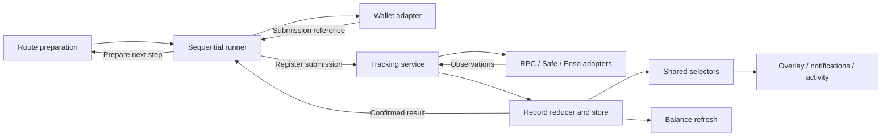

# Transaction Lifecycle v2

Draft proposal, 2026-09-08. This document replaces the **proposed architecture** in
[Transaction Lifecycle v1](./transaction-lifecycle.md). The v1 current-system map remains useful background.
Neither document describes a completed implementation. The implementation baseline for this proposal is
`main` at `afd41bcb`.

## 1. Objective

Make deposit and withdrawal flows easier to understand, change, and verify by sharing their execution lifecycle.

The target is **one sequential runner, one tracking service outside the overlay, one record reducer, and shared
presentation selectors**. Route preparation remains specialized. Direct calls, Enso calls, approvals, permits,
Safe proposals, and dynamic withdrawals use the same execution and observation rules.

Success means removing duplicate execution paths and status writers. Adding another abstraction without deleting
the corresponding old logic does not complete a migration.

This proposal does not redesign route selection, vault/share arithmetic, slippage policy, or visual styling. It
does not require a general workflow engine, an append-only event store, or a backend transaction indexer.

## 2. Ownership

| Component | Responsibility |
| --- | --- |
| Route preparation | Select and validate a route; calculate amounts; obtain a protected quote; simulate; prepare the next wallet action. |
| Sequential runner | Start and continue a reviewed intent, execute one step at a time, register submissions, and prepare subsequent steps from confirmed results. |
| Tracking service | Observe submitted EOA transactions, Safe proposals, and destination settlement independently of component lifetime. |
| Record store and reducer | Retain submission identity and evidence; apply observations consistently; persist and resume records when supported. |
| Presentation selectors | Derive flow progress, transaction outcome, tracking warnings, explorer references, and permitted user actions. |
| Overlay, notifications, activity | Render selectors and invoke explicit commands. |



`packages/vault-widget` owns framework-independent lifecycle semantics, the runner, tracking orchestration, and
shared selectors. Its runtime accepts host services. It does not import app contexts, IndexedDB, or app endpoints.

The host supplies wallet/RPC access, Safe and Enso observations, persistence, cross-tab coordination, and asset
refresh. `apps/yearn` supplies durable history. `apps/ybold` can initially use the same core with an in-memory store.
Persistence changes recovery guarantees, not the meaning of transaction success.

The service lives at provider scope. Opening or closing an overlay does not start or transfer receipt tracking.
Animations and completion callbacks do not decide transaction outcome.

## 3. Four concepts

| Concept | Meaning | Lifetime |
| --- | --- | --- |
| Flow | One reviewed user intent with an ordered recipe and a defined requested result. | Session-local until its first submission; then persisted with its records when supported. |
| Step | A prerequisite or requested action: a signature or a transaction. | Part of the flow; may require fresh preparation before execution. |
| Attempt | One attempt to perform a step. A retry has a new attempt ID. | Retains the relationship between a step and its submissions. |
| Transaction record | One accepted wallet submission or Safe proposal, including its source and destination evidence. | Begins when a submission reference exists; continues independently of the UI. |

A signature is not an on-chain transaction. A Safe batch is one submission, even when it includes approval and
execution calls. A cross-chain submission remains one transaction record as destination evidence arrives.
Wallet cancellation before submission does not create transaction history.

Use stable opaque IDs for flows, steps, attempts, records, and observations. IDs must not depend on mutable labels,
current array positions, or the latest transaction hash. Repricing updates a reference within the same record.

## 4. Sequential execution contract

### Start and continue

1. Capture the reviewed intent and its owner. Choose a route-specific ordered recipe.
2. Prepare only the next required wallet action. Preparation may depend on earlier confirmed results.
3. Validate that the action still matches the reviewed intent and current wallet context.
4. Request the signature or transaction once for this attempt.
5. For a signature, retain its result in the active session. For a submission, immediately register its reference
   with the tracking service and begin best-effort persistence.
6. Wait for the result required by the recipe. A successful source receipt is insufficient when the requested result
   requires destination settlement.
7. Prepare the next step, or derive completion of the requested action.

There is one outstanding wallet request per flow. Automatic continuation within an active session is allowed only
for the already reviewed sequence. An overlay rerender, stale callback, duplicate observation, or remount cannot
request the same wallet action again. Start/continue commands use a stable command identity so a double activation
reuses the outstanding operation instead of creating another flow or attempt.

Closing the overlay pauses future wallet requests; already submitted work continues to be tracked. If a wallet
request was already open, its eventual result must still be registered even after the overlay closes. Reopening
shows progress and requires an explicit Continue action before requesting another signature. Navigation, account
changes, and reload also require review before further execution.

### Freeze intent and submission inputs

The flow captures owner, recipient, vault/position, source and destination assets/networks, amount meaning
(`exact assets`, `exact shares`, or a defined MAX rule), and the user's applicable tolerances.

Each prepared transaction captures the actual input amounts with token identity and decimals, spender, protected
quote identity and validity where applicable, expected/minimum output, settlement requirement, and exact call
`to`, `data`, and `value`. Expected output is not a realized amount.

Before every wallet request, revalidate owner, execution network, allowance, simulation, quote freshness, and
permitted slippage. Permit data must still match its owner, chain, spender, amount, nonce, and deadline.
Calibration quotes cannot become executable transactions.

Background quote or balance updates cannot change an attempt after it enters the wallet. If fresh preparation
changes the requested amount, recipient, spender, network, or other reviewed terms, pause for review. After a hash
exists, history and tracking use the submitted snapshot, not current form state.

### Dynamic withdrawal steps

Unstake-and-withdraw is an ordered recipe, not two simultaneously executable calls:

`unstake → confirm → resolve withdrawable shares → prepare withdrawal → submit → confirm`

The next step uses attributable receipt/event evidence or validated route-specific post-confirmation reads.
Preserve exact-assets versus exact-shares semantics, wrapper conversions, redemption limits, and MAX behavior.
Do not infer the amount attributable to an unstake from an unexplained wallet balance increase when concurrent
activity makes that ambiguous. Missing or ambiguous inputs block preparation; they do not reverse the successful
unstake or justify submitting it again.

Preparation failure is a retry of preparation. It is not a retry of the confirmed transaction.

### Flow progress and retries

Derive flow progress from its recipe, selected attempts, records, and active session. Do not persist a separate
mutable aggregate success/error status.

| Situation | Meaning and available action |
| --- | --- |
| Approval confirmed; deposit not submitted or rejected | Approval complete; deposit still requires action. Do not label the requested deposit successful. |
| Unstake confirmed; withdrawal not completed | Preserve the asset-moving partial result; continue from withdrawal preparation after review. |
| Signature completed; transaction not submitted | Session can continue while the signature remains valid; reload requires preparation/review again. |
| An attempt definitively failed; a later attempt succeeded | Use the successful attempt for step completion and retain the earlier record in history. |
| An attempt is submitted with unresolved outcome | Observe or reconcile it; do not offer an ordinary send-again retry. |
| Required source and destination evidence is successful | Requested action complete, regardless of optional refresh health. |

A new attempt requires an explicit user action and fresh preparation. Completed transaction steps are never replayed
as a side effect of retrying another step. Persist minimal flow metadata such as its recipe version, selected
attempts, and interruption reason with the first submission. If session-only information is missing after reload,
show “needs review”; do not invent a prior rejection or completed signature.

## 5. Canonical records and evidence

The store persists reduced records plus a bounded diagnostic history. Typed observations are the only input to
the record reducer. Pollers and UI components cannot merge arbitrary notification fields.

The following is a data contract, not a required file layout or exhaustive TypeScript declaration:

| Field group | Required content |
| --- | --- |
| Identity | Schema version, stable record/flow/step/attempt IDs, immutable owner, creation time, store revision. |
| Submitted intent | Frozen display and execution inputs sufficient to identify what was submitted and refresh the relevant assets. |
| Submission | EOA original/effective references and replacement evidence, or a Safe proposal/calls reference plus its execution reference when known. |
| Source evidence | Safe status, validated replacement identity, admitted receipt, confirmation policy, and observation provenance. Retain each relevant fact. |
| Settlement requirement | Same-chain completion or asynchronous destination settlement; fixed at submission. |
| Settlement evidence | Normalized requested outcome, coverage/authority, destination references, bounded leg/callback details, refunds and recovery capabilities. |
| Tracking health | Stage, last attempt, last successful observation, next eligible check, and any outage or unresolved evidence conflict. |

Storage health and refresh results are associated diagnostics. They do not replace source or settlement evidence.
All persisted amounts use exact integer strings with token/decimal context. Timestamp units and chain identifiers
must be consistent across the persistence schema and adapter contracts.

### References stay paired

An on-chain reference pairs a hash with its execution network. Retain canonical chain identity separately when
execution uses a mapped network such as a Tenderly fork.

```ts
type TTransactionReference = {
  canonicalChainId: number
  executionChainId: number
  hash: `0x${string}`
}
```

Original EOA reference is immutable. Effective reference changes only after validated replacement evidence.
Safe proposal and wallet calls IDs are opaque references with their own kind; they are not mined transaction hashes.
Source, destination, and refund explorer links select a complete reference. Never fall back the hash and chain
independently. Explorer resolution must use the actual execution network or its host-provided explorer mapping.

### Derived transaction outcome

The reducer preserves evidence. A shared selector derives requested outcome; tracking health remains independent.

| Evidence | Derived meaning |
| --- | --- |
| Safe proposal without execution evidence | Awaiting Safe execution. |
| EOA hash or Safe execution hash without an admitted receipt | Submitted; source outcome pending. |
| Successful admitted receipt, same-chain requirement | Succeeded. |
| Successful admitted receipt, destination requirement unresolved | Source succeeded; settling destination. |
| Destination requires supported manual action | Source succeeded; awaiting user action. |
| Successful source receipt and authoritative destination delivery | Succeeded. |
| Definitive cancellation, unrelated replacement, Safe execution failure, reverted receipt, or terminal settlement failure | Requested action failed, with its specific reason and evidence. |
| Tracking cannot establish an unresolved stage | Outcome unknown at that stage; retain every already established fact. |

“Outcome unknown” is a projection of missing observation, not a destructive replacement for the record. Safe,
source, settlement, and recovery outages all use this rule. A later refund can enrich a failed action without
turning that action into a successful deposit or withdrawal. Completion time exists only for an established
requested outcome; stopping observation is not completion.

## 6. Observation and confirmation rules

An observation identifies its record, owner, stage, provider, semantic evidence identity, and observation time.
Where available, include provider revision/block identity. Apply it only to the submitted attempt and references
it describes. Local arrival time alone does not establish authority.

The reducer must enforce these rules:

1. Repeated equivalent observations are idempotent. Metadata cannot reassign owner, flow, step, or submitted inputs.
2. Receipts match the effective reference, or arrive with validated replacement evidence that establishes it.
3. All active and resumed observers use the same host confirmation policy. Preserve the current Base threshold of
   two confirmations and one elsewhere initially; policy changes are explicit and tested.
4. A mined receipt below that threshold is provisional. It cannot complete a step or start destination settlement
   tracking. If its block is removed before admission, continue source observation.
5. A repriced transaction remains the same attempt. Confirmed cancellation or an unrelated same-nonce replacement
   ends the requested attempt with a distinct reason. Retain original and effective references.
6. Safe proposal acceptance and an outer transaction receipt alone do not establish successful Safe call execution.
   Normalize the relevant Safe execution result and apply the same receipt-admission policy.
7. Source success starts settlement only when the immutable requirement calls for it. Missing bridge metadata can
   limit observation but cannot convert a cross-chain action into same-chain success.
8. Older pending data, provider errors, refresh results, or timeouts cannot overwrite established execution evidence.
9. Conflicting authoritative evidence pauses automatic continuation and requests reconciliation. Retain the disputed
   evidence and its provenance; do not silently choose the most recently received response.

Confirmation is a policy threshold, not a claim of permanent chain finality. A detected post-admission reorg or
provider correction uses the conflict/reconciliation path. Corrected evidence must explicitly supersede the
invalidated observation and preserve a diagnostic record. Ordinary polling updates cannot rewrite terminal outcomes.
This proposal does not require a general chain reorg indexer.

## 7. One tracking service; atomic persistence

The tracking service adopts a submission immediately and continues through source confirmation and, if necessary,
destination settlement. The runner waits on its result. The overlay and notifications only subscribe.

### Submission and storage failure

Wallet submission and local persistence cannot be one atomic transaction.

- Register the returned reference and its snapshot in memory before waiting for durable storage. Start observation
  immediately. Persist the flow metadata and first child record together when storage is available.
- Bound storage waits. A rejected or stalled write sets a storage warning and retries under the same IDs. It does
  not lose the hash, block receipt observation, or enable another wallet submission.
- Merge hydration with in-memory submissions; loading old rows must not overwrite newer observations or create
  duplicate records. On successful storage recovery, reconcile queued observations against the current revision.
- If storage never succeeds, history may be lost on reload. Show that limitation while retaining active-session
  progress and explorer access.
- Wallet rejection or a known pre-broadcast failure permits another attempt after review. If the wallet response is
  ambiguous about whether it broadcast, keep the session unresolved even without a hash. Missing a hash is not proof
  of failure. Ask the user to verify wallet activity; do not label a resend safe.

There is no durable transaction record without a submission reference. Recovery across reload is guaranteed only
for saved references and the evidence the host can retrieve; unresolved broadcasts without a saved reference are
an explicit limitation.

### Concurrency

Serialize observation application through an atomic read–reduce–write store operation. A terminal guard around
separate database reads and writes is insufficient. Deduplicate by semantic evidence as well as observation ID.

Within a host instance, maintain one source observer per submitted record. Across browser tabs, the durable host
coordinates observer ownership and propagates committed record changes. If Web Locks or an expiring ownership
mechanism is used, keep it private to infrastructure. Reject observations from an expired ownership generation;
retrying against a newer record revision does not authorize an old worker.

The public widget API does not expose lease acquisition, renewal, or release. Reload reconstructs tracking from
records; closing an overlay does not transfer ownership. A no-op or unavailable persistence adapter must still
provide the correct in-memory lifecycle.

Each tracking adapter defines a bounded request timeout, retry/backoff policy, and any automatic observation
deadline. Reaching a deadline pauses observation with an unresolved meaning. An explicit recheck resumes the
relevant stage without clearing evidence or requesting another wallet action. Storage retries use the same rule
of bounded work; provider and persistence outages cannot create tight retry loops.

### Replacement recovery after reload

Persist confirmed submission identity when obtainable: sender, nonce, target, value, and calldata. Keep it local;
do not include full calldata in remote logs. An estimated nonce is not authoritative identity.

Use one replacement-aware observation adapter for active and resumed records. The initial guarantee is to resume
the saved effective hash and detect replacements when the available identity/provider supports it. Discovering an
already-mined replacement after reload requires a bounded lookup strategy and dedicated tests; storing a nonce
alone does not provide that capability. If replacement recovery cannot be established, retain an unknown outcome
and explorer/wallet reconciliation. Do not report failure or automatically resend.

## 8. Enso settlement boundary

Enso chooses the route and bridge protocol. Execute its validated router call without rewriting `to`, `data`, or
`value`. Required approvals remain separate steps or part of an atomic Safe batch.

Before submission, capture the destination requirement, all available route-time bridge legs, request identifiers,
refund metadata, and delivery estimates from the executable quote. Protocol names are bounded, path-safe opaque
data. Unknown names are not an execution allowlist failure. Incomplete route metadata remains explicitly incomplete.

The Enso adapter owns provider-specific normalization. The core consumes one common contract:

- **Requested outcome:** pending, manual action required, delivered, or failed, with evidence and authority.
- **Coverage:** whether the response authoritatively describes the whole requested route or only identified legs.
- **References and details:** known source/destination transactions, stable leg identities, callbacks, and bounded
  provider detail. Merge without erasing previously observed evidence. Adapter-local array positions alone do not
  identify a leg across different responses.
- **Fund disposition:** unknown, in transit, delivered, refundable, refund pending, refunded, or otherwise recoverable,
  only as supported by evidence. Expected refund assets do not prove an actual refund.
- **Recovery capability:** a supported external action or an implemented in-app recovery adapter, its network and
  prerequisite evidence. Provider text alone is not executable recovery instructions.

An authoritative overall Enso delivery can establish completion without individually enumerated legs. A partial
response establishes completion only when the full required leg/callback coverage is known and satisfied.
An empty list is not proof of coverage. Conflicting overall and detailed evidence requires reconciliation.
Missing destination hashes do not by themselves disprove otherwise authoritative delivery.

A recovery transaction gets its own flow/record linked to the original record. Its successful receipt proves only
that recovery call's execution. Re-observe the original settlement before changing its presentation. A refund
does not relabel a failed requested action as successful. Keep recovery observation eligible after failure while
recovery remains unresolved; pause rather than silently discard it when its observation budget expires.

### Scheduling and the server budget

Browser selection is fair: choose eligible never-checked records first, then the least recently checked. Update
attempt time for successful and failed requests. Use stable IDs as tie-breakers; honor each record's next eligible
check time. Source receipt confirmation and recovery capability determine stage eligibility.

The server gateway owns request deduplication, cache, credential-wide pacing, and backoff. Enso currently documents
one bridge-status request per ten seconds per API key, or per IP without authentication. The server's shared key
means this budget spans users and server instances, not just browser tabs. Use shared coordination or an explicitly
single scheduler; a per-process timer or per-URL cache cannot claim this guarantee.

Return cached evidence with its original observation time and an explicit next eligible check time. HTTP 429,
unsupported status endpoints, timeouts, and gateway deferrals are observation limitations. They do not establish
transaction failure. Under finite eligible load, queueing must give every record opportunities to advance;
delivery estimates are scheduling hints, not settlement evidence.

This gateway bounds upstream status requests. It does not own transaction history or index wallet activity.
Deployment must select and test a coordination mechanism before claiming a global budget guarantee.

Provider reference, checked during the 2026-09-08 audit:
[Enso bridge transaction status](https://docs.enso.build/pages/build/get-started/bridge-status).
Keep protocol fixtures and detailed mappings in the adapter tests rather than expanding the core state machine.

## 9. Refresh and presentation

Apply confirmation/settlement evidence before scheduling balance refresh. A rejected or never-resolving refresh
cannot hold a transaction pending or change its outcome.

Refresh is an idempotent effect keyed by record and milestone: source confirmation, destination delivery, or
observed refund. Refresh only the relevant assets on their actual networks. Concurrent invalidations may be
coalesced. These effects may run again after a crash; correctness must not rely on exactly-once execution.

Distinguish display refresh from the data needed to prepare a subsequent transaction. Preparation can remain blocked
while a confirmed step stays successful. “Retry preparation” and “Refresh balances” must never submit a transaction.

All surfaces share selectors for transaction outcome, flow progress, tracking/storage/refresh warnings, and complete
explorer references. Available commands are explicit: start, continue after review, retry preparation, recheck a
record, refresh balances, or invoke a supported recovery action. A generic Retry button must not guess among them.

The wallet indicator aggregates owner-scoped records after hydration. Active work and required user action take
priority, then unresolved outcomes, unacknowledged failures, and recent success. Metadata-only writes cannot clear
the indicator. Acknowledgement and display windows are presentation policy; neither changes transaction evidence.

Persist approval-management submissions through the same lifecycle, with technical approval rows hidden from
default activity and available when expanded. This applies to EOA and Safe wallets. Do not couple tracking
correctness to which rows the user chooses to display.

## 10. Required scenarios

| Scenario | Required observable behavior |
| --- | --- |
| Direct deposit or withdrawal | One reviewed submission; shared confirmation policy; all surfaces agree. |
| Approval → action | Approval completes independently; rejection of the action leaves an explicit continuation. |
| Permit → action | Signature creates no transaction row; expiry/account change requires preparation again. |
| Allowance reset or approval management | Required reset/approval sequence remains explicit; records use the common lifecycle. |
| Unstake → MAX withdrawal | Withdrawal waits for validated share inputs; preparation retry never replays unstake. |
| EOA speed-up, cancel, unrelated replacement | Preserve original reference; adopt only validated effective reference; distinguish outcomes. |
| Safe approval/action batch | One proposal/record; no splitting an atomic batch; receipt plus execution result determines success. |
| Safe execution outage | Retain proposal and prior evidence; resume observation without proposing again. |
| Cross-chain source success | Refresh spent source assets; remain settling until destination outcome is established. |
| Unknown protocol, incomplete legs, missing destination hash | Preserve the destination requirement; never infer same-chain success or invent a link. |
| Manual execution or refund | Show supported action and evidence; record recovery separately; preserve requested outcome. |
| Source/settlement/recovery outage then reload | Retain known evidence; resume saved records without a wallet prompt. |
| Storage rejects or stalls after a hash | In-memory tracking continues; warning and reference remain; no second submission. |
| Refresh rejects or stalls | Confirmed outcome remains visible; other tracking continues; refresh-only retry. |
| Account switch, close, navigation, remount | Submitted owner stays immutable; no automatic continuation or duplicate wallet request. |
| Two tabs, late former worker, concurrent bridges | Atomic observations, ownership fencing where used, fair scheduling, no evidence regression. |
| Two server instances sharing an Enso key | Combined upstream requests respect the credential budget; deferrals retain observation meaning. |
| In-memory host | Correct active-session flow with explicitly limited reload history. |

Exercise the runner, tracker, fake wallet, storage, providers, and clock together. Assert wallet-call counts,
submitted inputs, selected attempts, retained evidence, rendered status, and permitted commands. Add focused
reducer cases for duplicated, stale, mismatched, contradictory, and corrected evidence. Preserve existing route,
amount, quote, Safe, and replacement tests. Before rollout, perform controlled wallet/Safe and available bridge QA.

## 11. Incremental migration

Every completed stage must keep existing supported transaction flows operational with equivalent normal
user interactions. Unmigrated paths continue through the existing implementation. A stage must not require
a later stage to restore deposits, withdrawals, approvals, Safe execution, or supported zaps. Intentional
changes to failure/status handling must be documented. Before rollout, verify transaction and UX parity
with regression tests and controlled wallet/Safe/bridge QA for the affected paths; a passing build alone
does not establish that parity.

| Stage | Deliver | Remove or prevent |
| --- | --- | --- |
| 1. Characterize and fix bounded defects | Scenario fixtures; fix legacy refresh rejection, atomic explorer pairs, receipt-depth consistency, fair bridge selection, and aggregate indicator. | Tests that encode known inconsistent behavior as desired behavior. |
| 2. One complete same-chain path | Shared runner/tracker/reducer from preparation through overlay and activity; cover direct and raw Enso submissions. In-memory and durable hosts both work. | Migrated overlay receipt polling and direct status merges; a second executor for the migrated path. |
| 3. Sequential and Safe paths | Approvals, permits, dynamic unstake, and Safe proposals/batches through the same engine. Include app-specific migration, rewards, portfolio claims, and yvUSD producers. | Equivalent step-advancement effects, completion flags, and separate receipt implementations. |
| 4. Destination settlement | Common Enso normalization, fair gateway scheduling, recovery links/capabilities, milestone refresh. | Bridge-specific outcome logic in overlays and independent notification writers. |
| 5. Finish persistence and presentation cutover | Versioned legacy decoding; all owner-scoped surfaces use selectors; documented reload guarantees. | Legacy partial-update APIs and duplicated lifecycle types, once all producers are migrated. |

Each migrated record has exactly one authoritative engine. A read-only shadow comparison can validate projection
differences; it cannot submit, poll independently, or execute refresh effects. Legacy writes for migrated records
must be disabled or translated into observations before they can touch the canonical store.

Compatibility projections flow from canonical records to legacy views. Do not maintain two writable truths.
Decode old rows conservatively: preserve usable references and reported history, but never invent missing receipts,
destination evidence, amounts, or flow membership. An incomplete historical record can remain explicitly limited.

Rollout and rollback preserve record IDs and schema readability. Disable a new execution path without discarding
its submitted records or creating duplicate attempts. Schema migrations must be repeatable and preserve old rows
until the decoder and rollback path have been verified.

Completion criteria: one execution lifecycle for all in-scope producers; one record transition implementation;
no receipt polling in presentation components; no direct notification-status writes outside the compatibility
boundary; shared selectors across overlay, wallet indicator, and activity; the required scenario matrix passes.

## 12. Starting decisions and implementation references

This proposal selects these defaults: sequential recipes; explicit review after interruption/reload; reduced records
with bounded diagnostics; technical approval history; local-only replacement identity; session-only yBOLD history;
and tracking ownership hidden behind the host infrastructure. No state-machine library is required.

Two infrastructure choices remain implementation gates: the durable host's atomic/cross-tab store mechanism and
the server's shared Enso request-budget mechanism. The mechanisms may vary, but their behavior above is required.
Stronger discovery of already-mined replacements after reload is a separate, testable capability; it must not be
implied by the presence of stored identity alone.

Current entry points to replace or adapt:

- [Styled-plan eligibility](../packages/vault-widget/src/components/widget/shared/plannedTransaction.tsx)
  and [plan executor](../packages/vault-widget/src/headless/executeTransactionPlan.ts).
- [Legacy overlay](../packages/vault-widget/src/components/widget/shared/TransactionOverlay.tsx),
  [deposit orchestration](../packages/vault-widget/src/components/widget/deposit/index.tsx), and
  [withdrawal orchestration](../packages/vault-widget/src/components/widget/withdraw/index.tsx).
- [Execution adapter](../packages/vault-widget/src/adapters/wagmiExecutionAdapter.ts)
  and [runtime boundary](../packages/vault-widget/src/runtime.tsx).
- [Notification persistence](../apps/yearn/src/components/shared/contexts/useNotifications.tsx),
  [source tracker](../apps/yearn/src/components/shared/hooks/useTransactionStatusPoller.ts), and
  [tracking coordinator](../apps/yearn/src/components/shared/hooks/useTransactionTrackingCoordinator.tsx).
- [Bridge poller](../apps/yearn/src/components/shared/hooks/useEnsoBridgeStatusPoller.ts),
  [bridge gateway](../apps/yearn/src/server/enso/bridgeStatus.ts), and
  [notification presentation](../apps/yearn/src/components/shared/utils/notificationLifecycle.ts).
