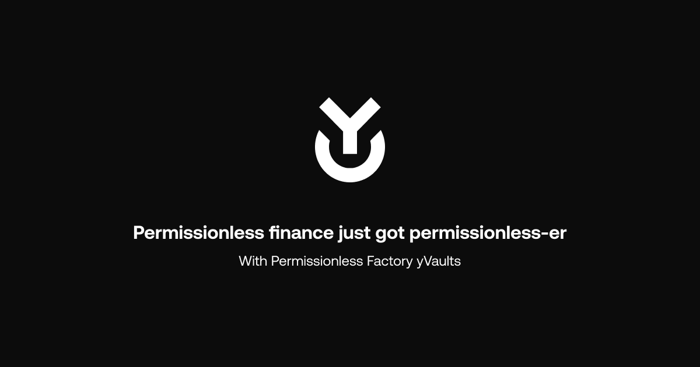

# yearn.fi



### Initial Setup

-   Fork the [original repo](https://github.com/yearn/yearn.fi) into your GitHub account
-   Clone the forked repo from your GitHub account to your local machine

    ```
    git clone https://github.com/<your-gh>/yearn.fi.git
    ```

-   Set origin to your fork. This is where you push your changes to. This is done automatically by the step above.

    ```
    git remote add origin https://github.com/<your-gh>/yearn.fi
    ```

-   Set upstream to original repo.

    ```
    git remote add upstream https://github.com/yearn/yearn.fi.git
    ```

-   Optional: Create `.env` file in root directory of repo then copy contents of `.env.example` to `.env` and replace values with your own keys. If you do not do this the default values from `next.config.js` will be used.

    ```
    cp .env.example .env
    ```

### Install and run

1. Run `yarn`
2. Run `yarn run dev`
3. Open the browser and navigate to `http://localhost:3000`

### Run with Docker

This project can be run with Docker.

1. Build the image: `docker build -t [name-of-your-container] .`
2. Run the container: `docker run -p 3000:3000 [name-of-your-container]`
3. Open the browser and navigate to `http://localhost:3000`

### Making Changes

-   Create a new local branch from upstream/main for each PR that you will submit
    ```
    git fetch
    git checkout -b <your branch name> upstream/main
    ```
-   Commit your changes as you work
    ```
    git add .
    git commit -S -m "message"
    ```
    -   [info about verified commits](https://docs.github.com/en/github/authenticating-to-github/managing-commit-signature-verification)

### Pushing Changes to your Repo

-   Commits are squashed when PR is merged so rebasing is optional
-   When ready to push
    ```
    git fetch
    git merge upstream/main
    git push origin <branch-name>
    ```

### Submitting Pull Request

-   Go to your GitHub and navigate to your forked repo
-   Click on `Pull requests` and then click on `New pull request`
-   Click on `compare across forks`
-   Click on `compare:` and select branch that you want to create a pull request for then click on `create pull request`
